# 2. Princípios e elementos básicos das PCBs

As Placas de Circuito Impresso (PCBs) constituem elementos fundamentais no universo da eletrônica, projetadas para interconectar e sustentar componentes eletrônicos de forma organizada e funcional. Neste capítulo, serão apresentados os princípios que norteiam o funcionamento das PCBs, além de uma análise dos principais elementos que as compõem.

## 2.1. Funções principais de uma PCB

- **Suporte físico**: Proporciona estrutura mecânica para fixação e posicionamento dos componentes eletrônicos.
- **Conexão elétrica**: Viabiliza a transmissão de sinais elétricos entre os componentes, por meio de trilhas condutoras.
- **Isolamento elétrico**: Mantém circuitos isolados, prevenindo curtos-circuitos e interferências indesejadas.
- **Dissipação térmica**: Facilita a transferência do calor gerado pelos componentes durante sua operação, contribuindo para a estabilidade térmica do sistema

## 2.2. Principais elementos da PCB

A fabricação de Placas de Circuito Impresso (PCBs) depende diretamente da seleção criteriosa dos materiais constituintes, que são determinantes para a qualidade, confiabilidade e desempenho final da placa.

### 2.2.1. Substrato

O substrato é a base estrutural das PCBs, servindo como suporte para a montagem dos componentes eletrônicos. O material mais comumente utilizado é a fibra de vidro (FR4), amplamente adotada por sua estabilidade térmica, alta resistência à decomposição e baixo custo. Em projetos que exigem alta frequência, materiais como PTFE (politetrafluoretileno) são preferidos devido à sua constante dielétrica mais baixa e perdas reduzidas, embora apresentem maior dificuldade de processamento. Em projetos de alta frequência, onde a constante dielétrica e baixas perdas são cruciais, placas à base de PTFE (politetrafluoretileno) podem ser utilizadas, embora sejam mais difíceis de processar. O substrato de fenolite também pode ser utilizado, mas as propriedades mecânicas são inferiores quando comparado com o FR4.

### 2.2.2. Cobre

O cobre é um elemento essencial nas PCBs, utilizado para formar as trilhas condutoras que conectam os componentes eletrônicos. Essas trilhas, criadas a partir de placas revestidas com camadas de cobre, garantem a condução eficiente de sinais elétricos. Para projetos de dupla face ou multicamadas, a aderência do cobre ao substrato, especialmente ao FR4, é uma característica crucial para a durabilidade e desempenho do circuito. As placas de cobre revestidas são obtidas a partir do substrato (geralmente FR4) com uma camada de cobre aderida, geralmente em ambos os lados (dupla face). A aderência do cobre ao FR4 é bastante sólida, enquanto a aderência ao PTFE pode ser mais desafiadora.

### 2.2.3. Máscara de solda

A máscara de solda é uma camada de polímero aplicada sobre as áreas expostas de cobre nas PCBs, com a função de proteger contra oxidação, prevenir curtos-circuitos e facilitar o processo de soldagem. Disponível em várias cores, como verde, vermelho e azul, essa camada contribui para a durabilidade e confiabilidade da placa, ao mesmo tempo que oferece um acabamento estético. A máscara de solda geralmente é composta por uma camada de polímero e apresenta cores como verde escuro, vermelho, azul, preto, branco ou outra cor disponível no fabricante.

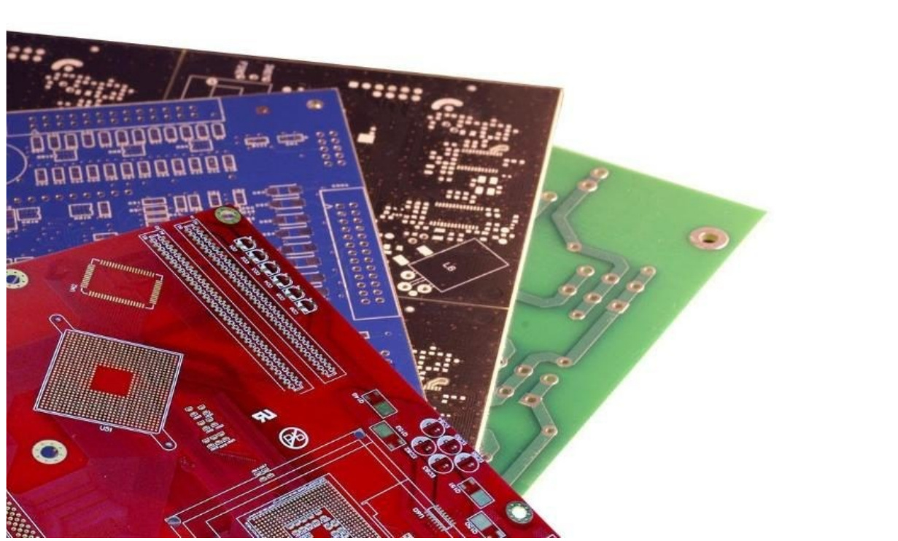

*Figura 1: Exemplos de PCBs*

### 2.2.4. Camada de serigrafia

A camada de serigrafia é composta por tinta aplicada na superfície da PCB, destinada a fornecer informações úteis, como identificação de componentes, orientações de montagem e dados de fabricação. Essa camada desempenha um papel crucial na montagem e manutenção de dispositivos eletrônicos, facilitando a localização precisa de componentes e contribuindo para uma montagem eficiente e com menor probabilidade de erros.

Ao compreender os principais elementos das Placas de Circuito Impresso e suas funções, é possível garantir que o processo de fabricação de PCBs resulte em produtos de alta qualidade, atendendo às demandas específicas de cada projeto eletrônico.

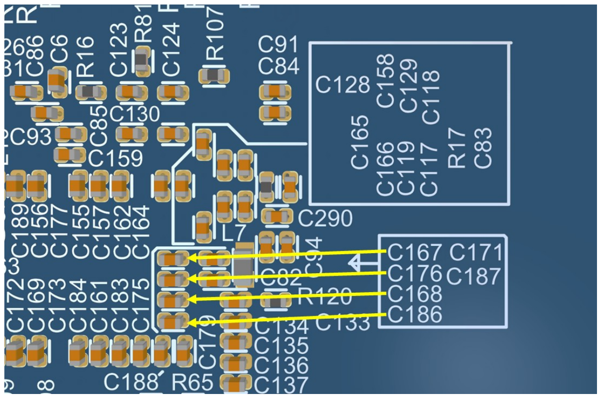

*Figura 2: Exemplos de serigrafias*

### 2.2.5. Acabamento de superfície

O **acabamento de superfície** (*surface finish*) compõe uma interface crítica entre os componentes e o local onde serão posicionados para solda, também chamada de SMOBC (Solder Mask Over Bare Copper) – Máscara de solda sobre cobre exposto. Essa superfície, sem nenhum tratamento, ficaria com os pads de cobre expostos, o que resultaria em oxidação, deterioração e consequente perda de funcionalidade.

O acabamento de superfície possui essencialmente duas funções:

- Proteger o circuito de cobre exposto;
- Prover uma superfície com maior soldabilidade, bem como reforçar o processo de montagem, promovendo uma junta de solda confiável com alto desempenho da PCB a longo prazo.

O processo de acabamento superficial consiste em cobrir com metal ou material orgânico os elementos de cobre não cobertos pela máscara de solda. Este processo protege o cobre e facilita a soldagem dos componentes seja pelo processo manual, forno ou outra técnica.

As técnicas mais comuns para realizar o acabamento superficial são:

- **HASL/HASL Lead free (Hot Air Solder Level)**

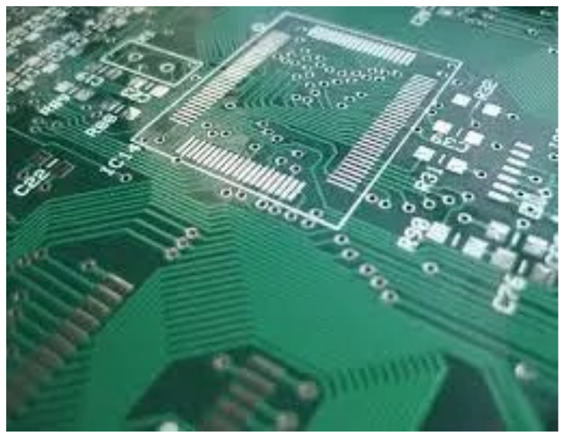

*Figura 3: Hot Air Solder Level-A*

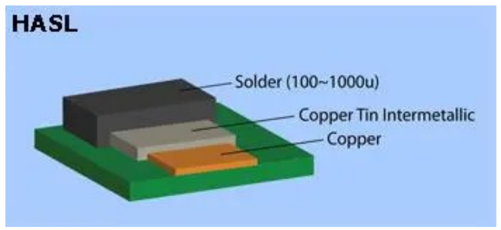

*Figura 4: Hot Air Solder Level-B*

- **Imersão em Estanho**

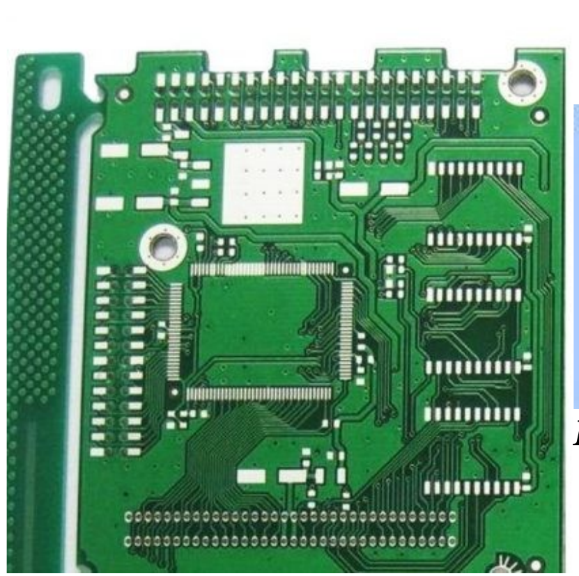

*Figura 5: Imersão em Estanho-A*

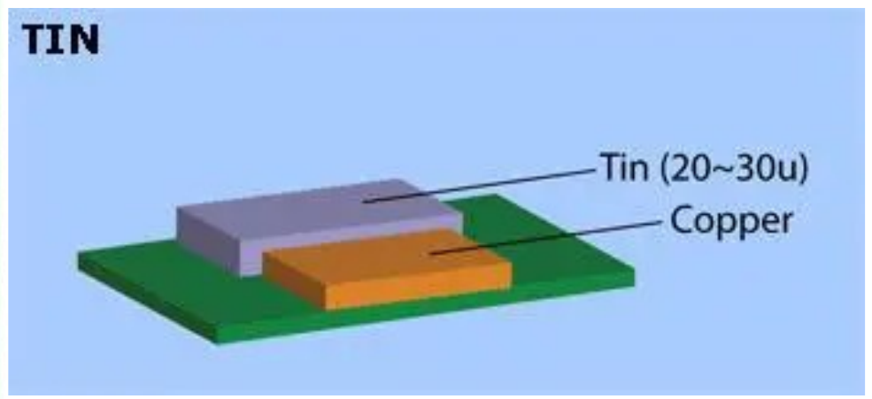

*Figura 6: Imersão em Estanho-B*

- **Imersão em Prata**

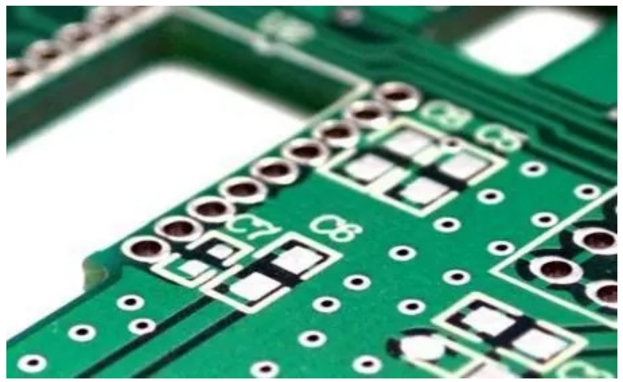

*Figura 7: Imersão em Prata-A*

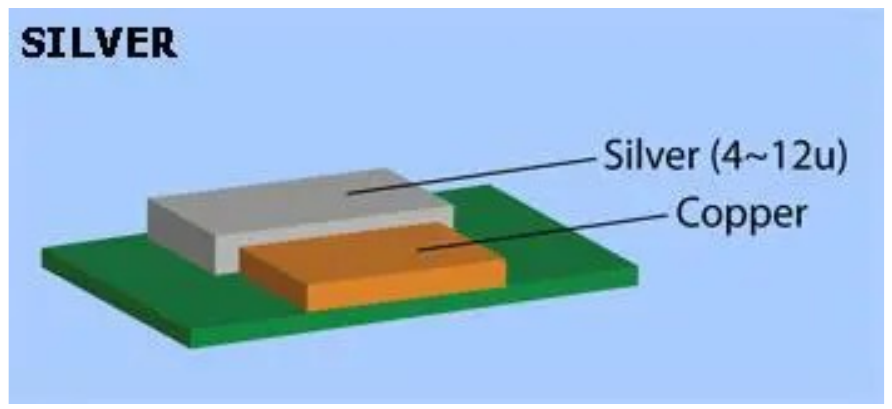

*Figura 8: Imersão em Prata-B*

- **OSP (Organic Solderability Preservative)**

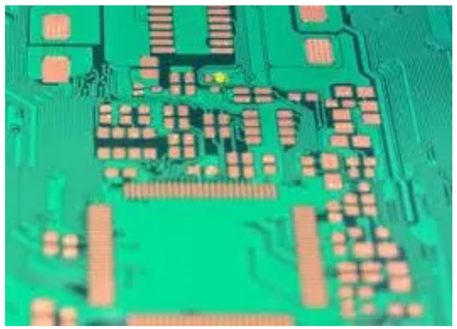

*Figura 9: Organic Solderability Preservative-A*

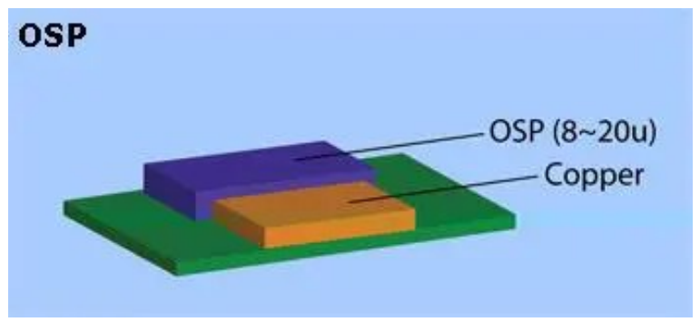

*Figura 10: Organic Solderability Preservative-B*

- **GOLD – ENIG (Electroless Nickel Immersion Gold)**

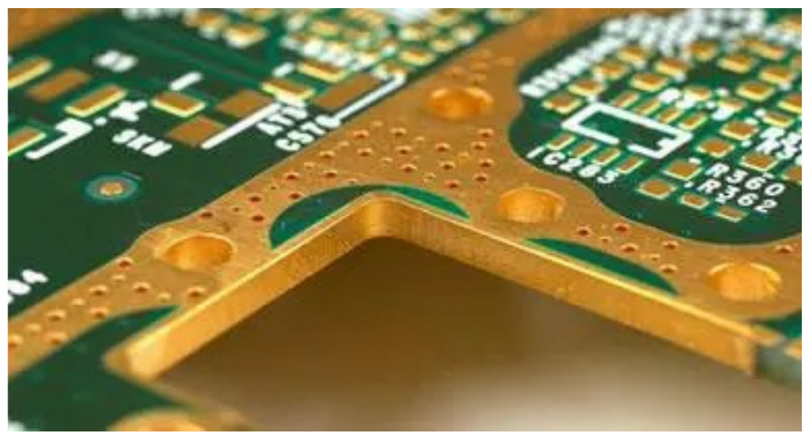

*Figura 11: Electroless Nickel Immersion Gold) - A*

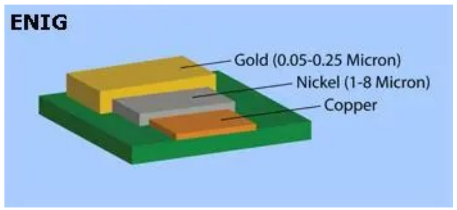

*Figura 12: Electroless Nickel Immersion Gold) - B*

- **ENEPIG (Electroless Nickel Electroless Palladium Immersion Gold)**

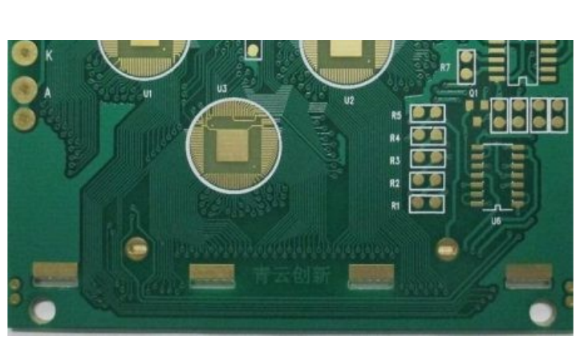

*Figura 13: Electroless Nickel Electroless Palladium Immersion Gold-A*

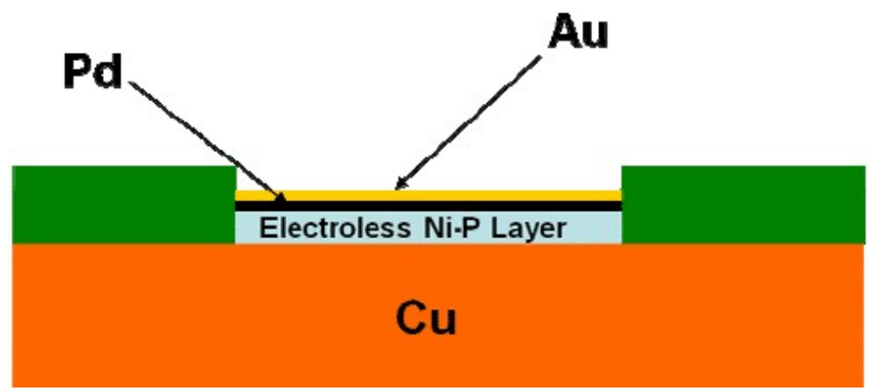

*Figura 14: Electroless Nickel Electroless Palladium Immersion Gold-B*

- **Gold – Hard Gold**

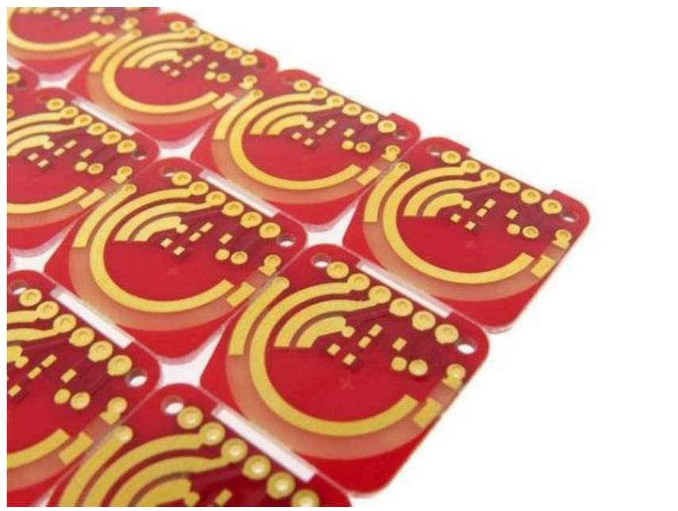

*Figura 15: Hard Gold-A*

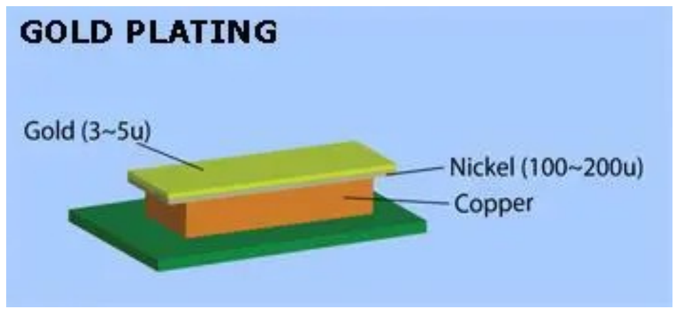

*Figura 16: Hard Gold-B*

## 2.3. Normas IPC

Uma placa que funciona na bancada não é automaticamente uma placa que pode ser
fabricada em série. Para que projetista, fabricante e montador cheguem ao mesmo
entendimento sobre o que é uma placa **aceitável**, a indústria eletrônica se
apoia em normas — e a mais difundida delas é publicada pela **IPC**.

### 2.3.1. O que é a IPC

A IPC é a associação global da indústria de interconexão eletrônica. O nome veio
de *Institute for Printed Circuits* e depois foi alterado para *Institute for
Interconnecting and Packaging Electronic Circuits*; hoje a sigla é usada como
nome próprio da organização.

Trata-se de uma associação mantida por seus membros, que publica especificações
de forma periódica. As normas IPC são as regras **mais amplamente aceitas** pela
indústria eletrônica e cobrem todas as etapas do ciclo de desenvolvimento de um
produto: projeto, compras, montagem, empacotamento e inspeção. Segui-las ajuda a
fabricar placas seguras, confiáveis e de alta qualidade — e, para o projetista,
produz um efeito prático imediato: **mantém projetista e fabricante no mesmo
entendimento** sobre o que a placa precisa cumprir.

::: {.quadro tipo="nota" titulo="Por que isso importa no seu projeto"}
Uma norma não é uma formalidade. As classes IPC existem porque a **mesma** placa
pode ser considerada aprovada ou reprovada dependendo do critério adotado. Ao
especificar a classe, você deixa explícito qual nível de inspeção e qual
tolerância a defeito são aceitáveis para o seu produto — e evita que cada lado
julgue a placa por uma régua diferente.
:::

### 2.3.2. As classes de qualidade

A **IPC-6011** descreve as classes de PCB e os **defeitos permitidos** em cada
tipo de placa. São três classes, com o acréscimo posterior de uma quarta,
definida pela **IPC-6012**:

| Classe | Aplicação típica | Confiabilidade exigida e defeitos admitidos |
|:---------|:-----------------------|:--------------------------------------------------------|
| **Classe 1** | Produtos eletrônicos de uso geral — controles remotos de TV, lâmpadas LED, brinquedos infantis | Vida útil limitada e função simples. Admite vários defeitos cosméticos, desde que não afetem o funcionamento; a confiabilidade não é fator crítico. É a placa mais barata de fabricar. |
| **Classe 2** | Produtos eletrônicos de serviço dedicado — notebooks, smartphones, tablets, equipamentos de comunicação | Confiabilidade maior e vida útil estendida; normas mais rigorosas que a classe 1, mas ainda se admitem algumas imperfeições cosméticas. O serviço ininterrupto é preferível, porém não crítico, e não há exposição a condições ambientais extremas. |
| **Classe 3** | Produtos eletrônicos de alto desempenho — suporte à vida, equipamentos militares, monitoramento eletrônico, automotivo | Deve fornecer desempenho contínuo, ou sob demanda, **sem parada** do equipamento; o ambiente de uso pode ser excepcionalmente severo. Exige níveis elevados de inspeção e ensaio, o que a torna altamente confiável. |
| **Classe 3/A** | Circuitos impressos de uso espacial e aviônica militar (IPC-6012) — aeroespacial, sistemas aéreos militares, sistemas de mísseis | Categoria mais alta para circuitos impressos. Critérios de fabricação muito rigorosos, pois a placa deve continuar operando em condições críticas. Consideravelmente mais cara, por precisar estar próxima da perfeição. |

A diferença central entre as classes **não está no desenho da placa, e sim no grau
de inspeção**: são as classes que definem quais defeitos são admissíveis durante a
fabricação.

Vale desfazer um equívoco comum: as classes 3 e 3/A são usadas principalmente em
equipamentos militares e aeroespaciais, mas **não são exclusivas** dessas áreas.
Elas podem ser aplicadas a qualquer produto — inclusive aos exemplos citados na
classe 2 —, porém deixam de ser economicamente viáveis pelo esforço de fabricação
e de inspeção que exigem.

### 2.3.3. Como escolher a classe

Ao escolher a classe, o projetista está escolhendo a **vida útil** do produto.
Muitas vezes a classe 2 atende a todos os requisitos e sai mais econômica. Se,
além de a aplicação ser crítica, espera-se que a placa dure muitos anos, a classe
3 passa a ser a escolha adequada. O ambiente em que o produto vai operar também
precisa entrar na conta, porque é ele que determina o grau de confiabilidade
exigido do projeto.

::: {.quadro tipo="dica" titulo="Qual classe escolher"}
A escolha é econômica antes de ser técnica. A **classe 2** costuma atender à maior
parte dos produtos — e sai mais barata. Reserve a **classe 3** para aplicações
críticas ou para produtos que precisem durar muitos anos: o material de referência
cita a fronteira de **15 anos** como um dos critérios de decisão. O ambiente de
operação do produto é o outro critério a considerar.
:::

### 2.3.4. Onde a IPC aparece na prática

Duas situações concretas em que a norma entra no dia a dia do projetista:

- **Anel anular:** a IPC define a posição dos furos sobre a ilha de solda (*pad*) e
  a largura do anel externo que resta depois da furação. Quando a ilha não
  circunda completamente o furo, tem-se um *annular ring breakout* — condição que a
  norma trata explicitamente, com limites de aceitação próprios para cada classe.
- **Juntas de solda e defeitos aceitáveis:** a IPC trata separadamente os defeitos
  que comprometem o desempenho da placa e as imperfeições puramente cosméticas, e
  estabelece padrões de aceitação para os processos de montagem. O **mesmo**
  defeito pode ser aprovado na classe 1 e reprovado na classe 3: o defeito não
  muda, o critério é que muda.

O Capítulo 7 traz os valores de anel anular e de furação praticados por um
fabricante real — é com esses números, e não com valores arbitrários, que o seu
projeto é conferido no DRC.

Fonte: IPC, *IPC Class 3 Design Guide* (material de apoio da disciplina).

## 2.4. Categorias de PCBs

- **PCBs de Face Única**: Contêm uma única camada de cobre em um dos lados do substrato, utilizadas em circuitos simples e de baixo custo.
- **PCBs de Dupla Face**: Possuem trilhas condutoras em ambos os lados do substrato, conectadas por vias, sendo amplamente usadas em designs intermediários.
- **PCBs Multicamadas**: Incorporam múltiplas camadas de cobre intercaladas com materiais isolantes, permitindo designs mais complexos e de alta densidade, comuns em dispositivos como smartphones e computadores. Compreender os princípios e os elementos que compõem as PCBs é o primeiro
passo para dominar o design dessas placas essenciais.
