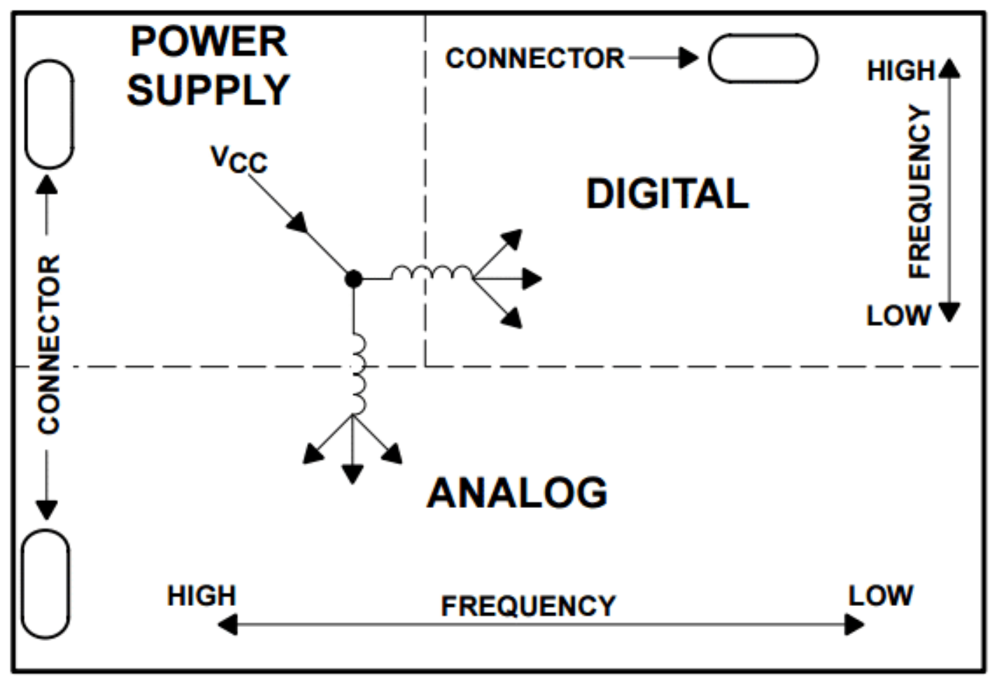
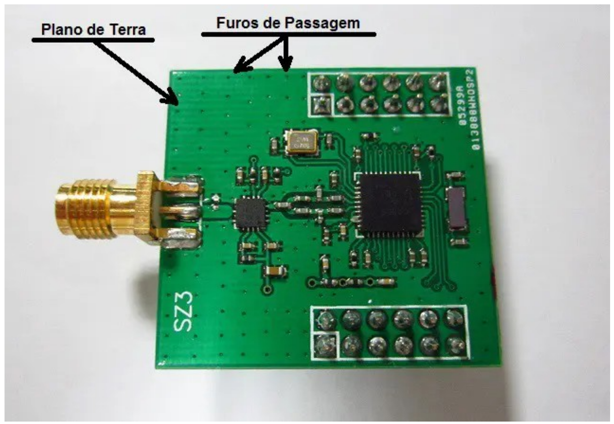
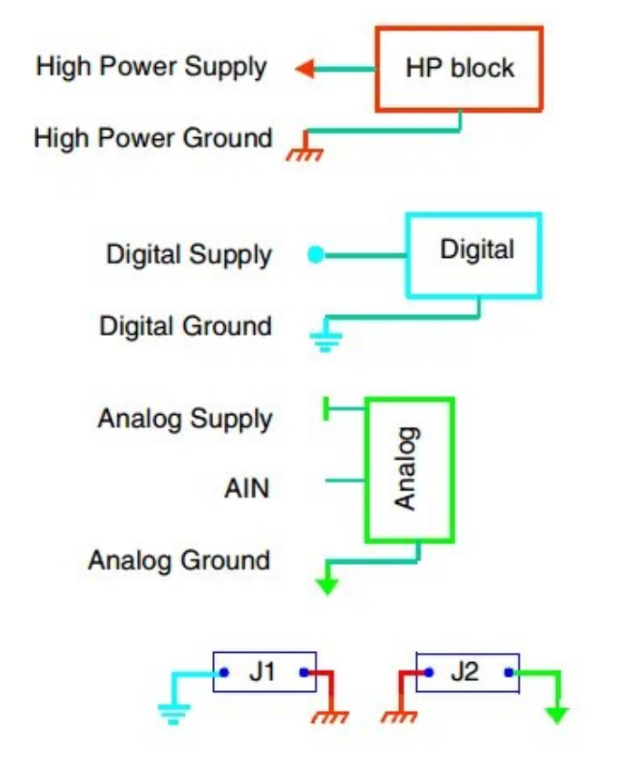
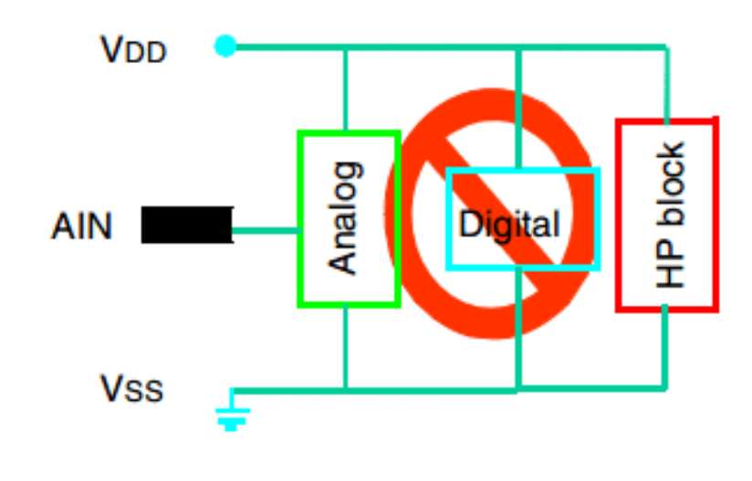
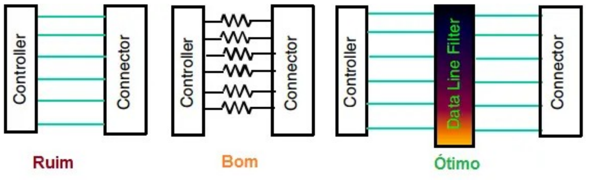

# 3. Boas Práticas de Design

O sucesso de um projeto de PCB depende não apenas de sua funcionalidade, mas também da facilidade de produção e da confiabilidade durante o uso. Para garantir que sua placa seja eficiente, econômica e durável, é essencial adotar boas práticas de design. Neste capítulo, abordaremos estratégias para evitar falhas comuns e melhorar a manufaturabilidade do seu projeto.

## 3.1. Planejamento Inicial

Antes de começar o roteamento, faça um planejamento cuidadoso do layout da placa, colocando os componentes de forma lógica e otimizada. Agrupe componentes relacionados e posicione-os de maneira que minimize os trajetos de conexão.

- Defina as camadas de PCB: determine quantas camadas de PCB você irá utilizar. Camadas adicionais podem permitir trajetos mais curtos e reduzir a interferência entre sinais.
- Rotas Críticas: identifique os sinais críticos, como sinais de alta velocidade, alimentação e terra. Roteie esses sinais primeiro, minimizando interferências e distâncias.

- Plano de Terra Adequado: certifique-se de criar uma área de plano de terra sólido na placa, conectando-a adequadamente a todos os pontos de terra. Isso ajuda a reduzir interferências e proporciona um retorno confiável para os sinais.
- Rotas Diretas e Curtas: mantenha os trajetos de roteamento o mais curtos e diretos possível para evitar atrasos de sinal, interferência eletromagnética e perda de sinal.
- Separação de Sinais: mantenha diferentes tipos de sinais separados para reduzir a interferência. Isso é especialmente importante para sinais analógicos e digitais, que podem interferir entre si.
- Regras de Projeto: defina regras de projeto no software de layout de PCB para garantir espaçamentos adequados entre trilhas, vias e componentes, evitando problemas como curtos-circuitos.
- Uso de Vias: utilize vias para conectar camadas diferentes de PCB. Coloque as vias de forma eficiente, evitando congestionamentos, e distribua-as uniformemente para ajudar na distribuição de energia e terra.
- Roteamento Manual vs. Automático: embora o roteamento automático possa ser útil, em muitos casos, um roteamento manual oferece mais controle sobre o layout. Comece com o roteamento manual e use o roteamento automático como uma ferramenta auxiliar, se necessário.
- Revisão e Simulação: antes de finalizar o layout, revise cuidadosamente todas as trilhas, vias e conexões. Além disso, é recomendável realizar simulações para verificar o desempenho do circuito, especialmente em termos de integridade de sinal.
## 3.2. Planejamento do Design

Antes de começar a desenhar a PCB, tenha um esquema elétrico bem elaborado e documentado. Planeje o layout considerando:

- **Fluxo do sinal:** Posicione os componentes para otimizar o percurso das conexões.

- **Gerenciamento de espaço:** Evite agrupamentos excessivos e deixe espaço suficiente para trilhas e pads.
- **Restrições mecânicas:** Considere dimensões da placa, pontos de fixação e encaixes.
## 3.3. Separação de Áreas Funcionais

Divida a placa em zonas, agrupando componentes relacionados. Por exemplo:

- Zona de potência: Para fontes e reguladores.
- Zona de sinal: Para circuitos de baixa tensão e alta frequência.
- Zona de controle: Para microcontroladores e circuitos lógicos. Essa separação reduz interferências e facilita o diagnóstico e a manutenção.
Veja a figura.

*Figura 17: Separação dos componentes em grupos de função*

## 3.4. Largura de Trilhas e Distância Mínima

Calcule a largura das trilhas com base na corrente que elas suportarão, mas a largura necessária **não depende só da corrente**: dependem também a elevação de temperatura admitida, a espessura do cobre e a camada (externa ou interna). Trilhas mais largas são necessárias para correntes maiores. Use a tabela ou calculadora do fabricante para o valor final. Além disso:

- Respeite as distâncias mínimas entre trilhas para evitar curtos-circuitos.

- Utilize ferramentas de verificação de regras de design (DRC) no software para garantir conformidade com os requisitos do fabricante ou equipamento a ser utilizado na fabricação.
## 3.5. Gerenciamento Térmico

- Posicione dissipadores de calor e vias térmicas próximas a componentes que geram muito calor.
- Utilize planos de aterramento e alimentação para distribuir o calor de forma eficiente. Evite áreas isoladas de cobre que podem atuar como hotspots.
## 3.6. Trilhas de Alimentação

Mantenha as trilhas de alimentação largas o suficiente para minimizar a queda de tensão devido à resistência.

## 3.7. Planos de Terra

- **Plano de Terra Sólido:** Crie um plano de terra contínuo em uma camada interna da PCB para fornecer um retorno eficiente para os sinais.
- **Conexão de Terra:** Conecte o plano de terra a todos os pontos de terra do circuito. Use várias vias para conectar as camadas de terra.
::: {.quadro tipo="importante" titulo="Plano de terra: um só, contínuo"}
Prefira **um plano de terra contínuo** a dividi-lo em regiões analógica e digital. O plano contínuo minimiza a impedância entre dois pontos de terra quaisquer e garante o caminho de retorno da corrente. A separação em regiões só se justifica em casos específicos e precisa de **um único ponto de interligação controlado** entre elas: dividir sem esse ponto transforma a emenda em antena e piora a integridade do sinal.
:::

- **Costura de vias (*stitching*):** posicione vias de terra na origem e no destino do sinal, para que a corrente de retorno possa voltar pelo plano de referência.

*Figura 18: Plano de terra e furos de passagem*

*Figura 19: Cada seção do circuito deve ter seu plano de terra, havendo a interligação entre eles*

*Figura 20: A ligação de todos os grupos na mesma linha de alimentação e terra não é recomendada*

## 3.8. Minimização de Interferências

- **Roteamento Paralelo e Perpendicular:** o acoplamento indutivo e capacitivo (*crosstalk*) **cresce com o comprimento em que duas trilhas correm paralelas e próximas**, e é mínimo quando elas se cruzam perpendicularmente. Portanto: mantenha o trecho paralelo entre trilhas sensíveis o mais curto possível, cruze-as em ângulo reto quando o cruzamento for inevitável e afaste-as onde o paralelismo for necessário.
::: {.quadro tipo="dica" titulo="Regra prática: espaçamento entre trilhas (3W)"}
Para reduzir *crosstalk*, mantenha o centro de uma trilha a pelo menos **3 vezes a sua largura (3W)** de outra trilha; **2W** é o mínimo aceitável. A regra **não** se aplica ao espaçamento interno de um par diferencial.
:::

- Trilhas de Sinal de Referência: Para sinais diferenciais, como USB ou Ethernet, mantenha as trilhas de sinal e referência equidistantes e paralelas respeitando a impedância necessária.
- **Referência de terra próxima ao sinal:** o plano de terra adjacente é o **caminho de retorno da corrente** e deve ficar contínuo e próximo da trilha de sinal — afastar o sinal do plano de referência aumenta a impedância e a emissão. O que precisa de afastamento são as trilhas de **outros sinais**, não o plano de referência.
- **Use Camadas de Sinal:** Utilize camadas de sinal adjacentes para trilhas de sinais complementares, como um plano de terra entre camadas de sinal.

- **Filtros e Blindagem:** Utilize componentes de filtragem, como capacitores e indutores, para reduzir o ruído de alta frequência. Considere a utilização de placas de blindagem para componentes sensíveis.
- **Roteamento Diferencial:** Para sinais de alta velocidade, como USB, HDMI ou PCIe, utilize roteamento diferencial e respeita a impedância pelo tipo de interface para reduzir a interferência e melhorar a integridade do sinal.
- Mantenha trilhas de alta frequência curtas e bem separadas de sinais sensíveis.
- **Use planos de referência (GND)** contínuos para reduzir ruídos e melhorar a integridade do sinal.
- **Adicione capacitores de desacoplamento** próximos aos pinos de alimentação de componentes IC.
- **Coloque sinais e trilhas de terra relacionados próximos** um do outro para minimizar a impedância e a interferência
## 3.9. Otimização de Pads e Vias

- Certifique-se de que os pads sejam grandes o suficiente para facilitar a soldagem.
- Evite vias muito próximas aos pads, o que pode causar problemas de soldagem.
- Use vias metalizadas para conexões confiáveis entre camadas.
## 3.10. Simplificação do Layout

::: {.quadro tipo="atencao" titulo="Ângulos na trilha: use 45°"}
Evite ângulos agudos e cantos fechados; prefira ângulos de 45°. A razão principal é de **fabricação**: ângulos agudos formam armadilha de ácido (*acid trap*) na etapa de corrosão, o que pode supercorroer a trilha e abrir o circuito.
:::
- Minimize o uso de vias desnecessárias, pois elas aumentam o custo e podem reduzir a confiabilidade.

## 3.11. Serigrafia Clara e Informativa

- Inclua rótulos claros para identificação de componentes e orientações de montagem.
- Evite sobrepor a serigrafia em pads ou vias.
## 3.12. Considerações de Fabricação

- Utilize espessuras de cobre padrão (geralmente 1 oz/ft²) para facilitar a produção.
- Respeite as tolerâncias do fabricante em relação a furos, espessura de trilhas e distâncias mínimas.
- Geração de arquivos de produção (Gerber) compatíveis com os requisitos da fabricante.
## 3.13. Testabilidade

Inclua pontos de teste para verificar as principais funções do circuito.

Garanta acesso físico aos pontos de teste durante a fase de inspeção e depuração.

## 3.14. Ligação das E/S do MCU com os conectores

::: {.quadro tipo="atencao" titulo="Nunca ligue o microcontrolador direto no conector"}
Nunca ligue diretamente os terminais de um microcontrolador nos conectores ou bornes da placa. Use uma interface entre as seções do sistema, como mostra a Figura 21.
:::

*Figura 21: É recomendado o uso de interfaces entre seções do sistema*
