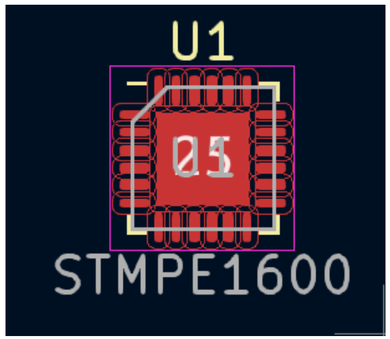
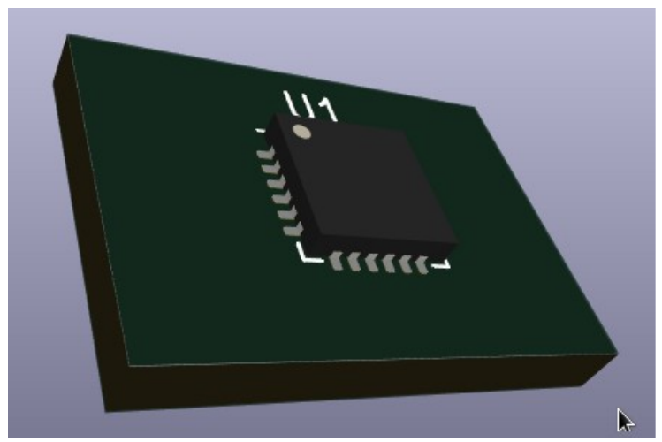
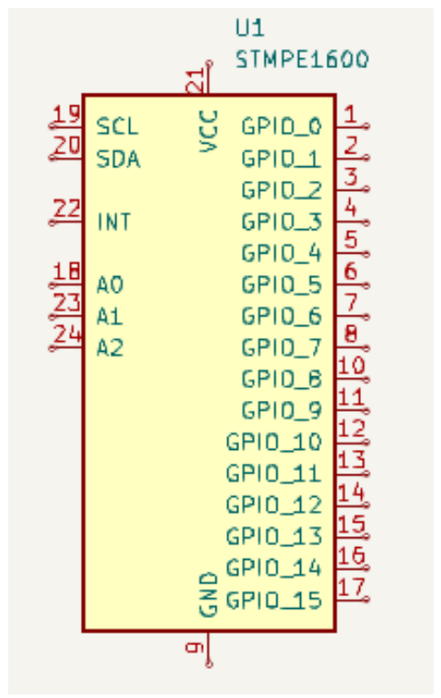
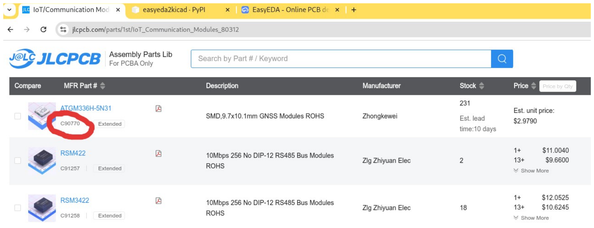
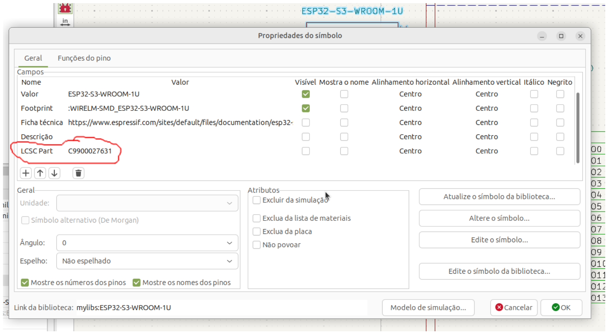
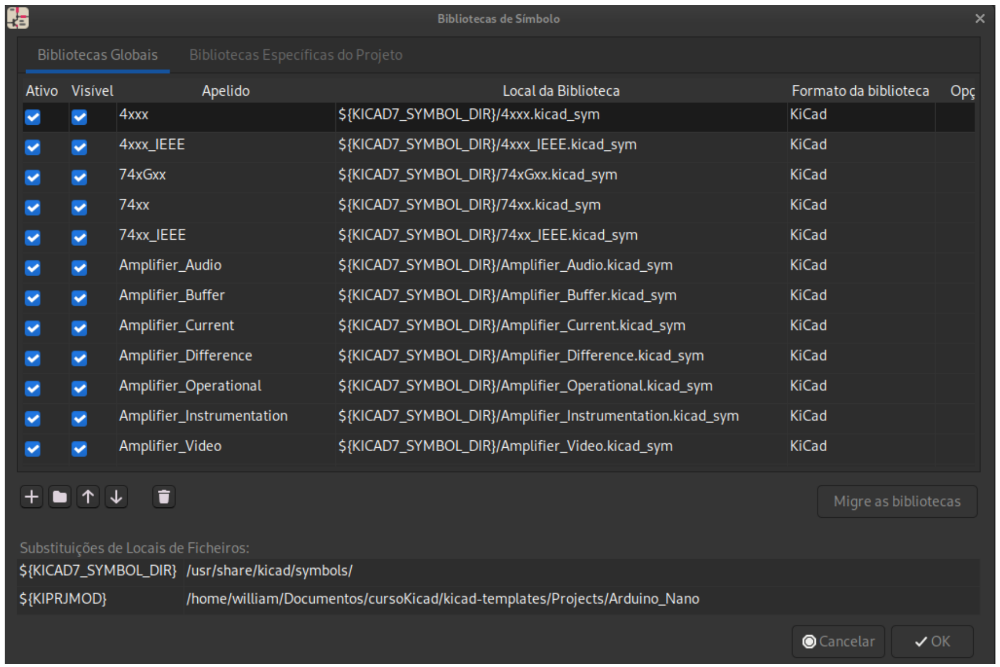
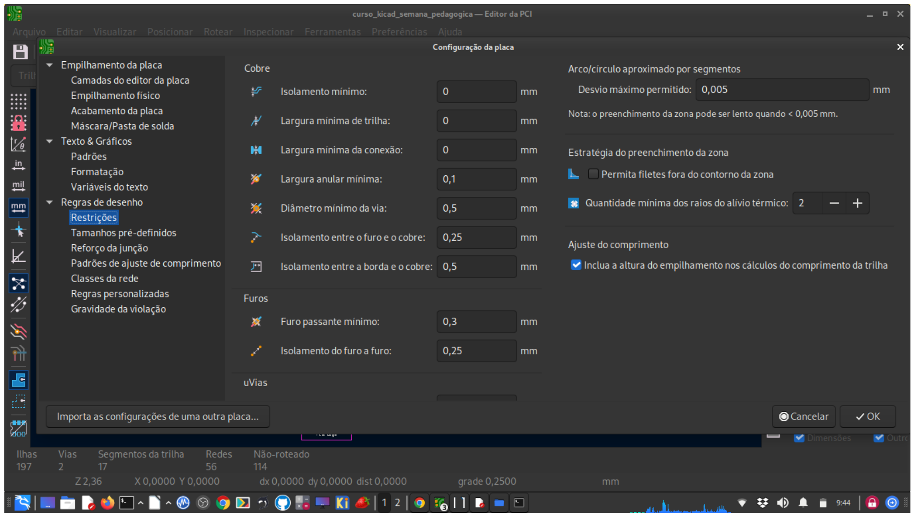

# 7. KiCad

O KiCad é um conjunto de softwares de código aberto voltado para a criação de projetos de design eletrônico. Ele é amplamente utilizado para desenvolver esquemáticos de circuitos eletrônicos e layouts de placas de circuito impresso (PCBs). O nome "KiCad" é uma abreviação de "Kicad-Computer-Aided Design".

O KiCad é uma ferramenta muito popular entre engenheiros eletrônicos, entusiastas e estudantes, oferecendo uma solução completa e gratuita para projetos eletrônicos. Ele é multiplataforma, o que significa que está disponível para Windows, macOS e Linux.

#### As principais funcionalidades do KiCad incluem:

- **Editor esquemático:** Permite criar esquemas eletrônicos, onde os componentes são conectados para formar um circuito funcional;
- **Editor de PCB:** Uma vez que o esquema esteja pronto, o KiCad permite projetar a PCB, posicionando os componentes e traçando as trilhas de cobre para conectar os componentes adequadamente;
- **Bibliotecas de componentes:** O KiCad inclui bibliotecas de componentes eletrônicos padrão, mas também permite a criação e gerenciamento de bibliotecas personalizadas.
- **Visualização 3D:** É possível visualizar o PCB em 3D, ajudando a verificar a colocação dos componentes e identificar possíveis problemas de interferência.
- **Simulação de circuitos:** o KiCad possui recursos de simulação, mas com algumas particularidades. Ele integra o ngspice, que é uma ferramenta de simulação SPICE amplamente utilizada para análises de circuitos eletrônicos. Essa funcionalidade permite simular circuitos analógicos e mistos diretamente no KiCad.
- **Gerenciamento de projetos:** O KiCad oferece uma interface para gerenciar facilmente os arquivos e recursos do projeto.

Devido à sua natureza de código aberto, o KiCad conta com uma comunidade ativa de desenvolvedores e usuários, o que significa que existem recursos adicionais, bibliotecas e plugins disponíveis para expandir suas funcionalidades.

## 7.1. Motivos para usar o Kicad

O KiCad apresenta diversas vantagens em relação a outros softwares concorrentes de design eletrônico. Algumas dessas vantagens incluem:

- **Código aberto e gratuito:** O KiCad é um software de código aberto, o que significa que você pode utilizá-lo sem custo e ter acesso ao código-fonte. Isso facilita a colaboração e permite que a comunidade de usuários contribua com melhorias e correções.
- **Multiplataforma:** O KiCad é compatível com Windows, macOS e Linux, o que o torna uma opção acessível para diferentes sistemas operacionais.
- **Comunidade ativa:** O KiCad possui uma comunidade grande e ativa de desenvolvedores e usuários. Isso significa que você pode encontrar suporte, tutoriais, bibliotecas adicionais e recursos para melhorar sua experiência com a ferramenta.
- **Integração e recursos completos:** O KiCad oferece um conjunto completo de recursos, incluindo editor esquemático, editor de PCB, bibliotecas de componentes, visualização 3D e gerenciamento de projetos. Isso permite que você realize todo o processo de design em uma única ferramenta, evitando a necessidade de importar e exportar projetos entre diferentes aplicativos.
- **Bibliotecas de componentes atualizadas:** O KiCad inclui uma biblioteca de componentes eletrônicos padrão e também permite que você crie e gerencie suas próprias bibliotecas. Além disso, a comunidade contribui com bibliotecas de alta qualidade, garantindo que você tenha acesso a uma ampla variedade de componentes para seus projetos.
- **Atualizações frequentes:** O KiCad é continuamente atualizado e melhorado pela comunidade de desenvolvedores, garantindo que você tenha acesso a recursos e correções de bugs mais recentes.

- **Sem limitações de tamanho de projeto:** Ao contrário de algumas ferramentas concorrentes que impõem restrições ao tamanho dos projetos na versão gratuita, o KiCad não possui essas limitações, permitindo que você trabalhe em projetos de qualquer tamanho sem custos adicionais.
- **Importação de arquivos de outros EDAs:** Documentos esquemáticos do Altium Designer, Circuit Studio, Circuit Maker; PCB de designer Altium; Fabricante de circuitos Altium PCB; Altium Circuito Estúdio PCB;; CB ASCII P- Cad 200x; PCB Fabmaster
## 7.2. Instalação do KiCAD

- Existem versões para Windows, Linux, macOS e Docker. Utilize a url apresentada para obter a versão desejada. <u>[https://www.kicad.org/download/](https://www.kicad.org/download/)</u>
## 7.3. Usando o gerenciador de projetos KiCad

O gerenciador de projetos KiCad é uma ferramenta que cria e abre projetos KiCad e inicia as outras ferramentas KiCad (editores de esquemas e placas, visualizador Gerber e ferramentas utilitárias).

 %20gerenciador,editores%20e%20ferramentas](figuras/figura-22.png)

*Figura 22: Gerenciador de Projetos. Fonte: [https://docs.kicad.org/8.0/en/kicad/kicad.html#:~:text=Usando%20o](https://docs.kicad.org/8.0/en/kicad/kicad.html#:~:text=Usando%20o) %20gerenciador,editores%20e%20ferramentas*

A janela do gerenciador de projetos do KiCad é composta por uma visualização em árvore à esquerda, mostrando os arquivos associados ao projeto aberto, e um iniciador à direita, contendo atalhos para os vários editores e ferramentas.

## 7.4. Arquivos e pastas KiCad

O KiCad cria e usa arquivos com as seguintes extensões de arquivo (e pastas) específicas para edição de esquemas e placas.

### 7.4.1. Arquivos de projeto

Arquivo de projeto, contendo configurações que são compartilhadas *.kicad_pro entre o esquema e o PCB

*.pro Arquivo de projeto Legacy (KiCad 5.x e anterior). Pode ser lido e será

convertido em um.kicad_proarquivo pelo gerente de projeto.

#### Arquivos do editor esquemático

Arquivos esquemáticos contendo todas as informações e os próprios *.kicad_sch componentes.

Arquivo de biblioteca de símbolos esquemáticos, contendo as *.kicad_sym descrições dos componentes: forma gráfica, pinos, campos.

Arquivo esquemático legado (KiCad 5.x e anterior). Pode ser lido e *.sch será convertido em um.kicad_scharquivo na gravação.

Arquivo de biblioteca esquemática Legacy (KiCad 5.x e anteriores). *.lib Pode ser lido, mas não escrito.

Documentação da biblioteca esquemática legada (KiCad 5.x e *.dcm anterior). Pode ser lida, mas não escrita.

Arquivo de cache de biblioteca de componentes esquemáticos legados *-cache.lib (KiCad 5.x e anteriores). Necessário para o carregamento adequado de um.scharquivo esquemático legado ( ).

Tabela de biblioteca de símbolos: sym-lib-table, lista de bibliotecas de símbolos disponíveis no editor de esquemáticos.

#### Arquivos e pastas do editor de PCB

Arquivo do quadro contendo todas as informações, exceto o layout da *.kicad_pcb página.

*.pretty Pastas da biblioteca Footprint. A pasta em si é a biblioteca.

*.kicad_mod Arquivos de pegada, contendo uma descrição de pegada cada.

Arquivo de regras de design, contendo regras de design *.kicad_dru personalizadas para um.kicad_pcbarquivo específico.

Arquivo de placa Legacy (KiCad 4.x e anteriores). Pode ser lido, mas *.brd não escrito, pelo editor de placa atual.

|*.mod fp-lib-table fp-info-cache|Arquivo de biblioteca de footprint legado (KiCad 4.x e anterior). Pode ser lido pelo footprint ou pelo editor de placa, mas não escrito. Tabela de biblioteca de footprint: lista de bibliotecas de footprint disponíveis no editor de quadro. Cache para acelerar o carregamento de bibliotecas de footprint. Não precisa ser distribuído com o projeto ou colocado sob controle de versão.|
|---|---|
||Arquivos comuns|
|*.kicad_prl|Configurações locais para o projeto atual; ajuda o KiCad a lembrar as últimas configurações usadas, como visibilidade de camada ou filtro de seleção. Pode não precisar ser distribuído com o projeto ou colocado sob controle de versão.|
|*.kicad_wks|Arquivo de descrição do layout da página (borda do desenho e bloco de título)|
|*.net *.cmp|Arquivo netlist criado a partir do esquema e lido pelo editor de placa. Observe que o fluxo de trabalho recomendado para transferir informações do esquema para a placa não requer o uso de arquivos netlist. Associação entre componentes usados no esquemático e seus footprints. Pode ser criado pelo Board Editor e importado pelo Schematic Editor. Seu propósito é importar alterações do board para o esquemático, para usuários que alteram footprints no Board Editor (por exemplo, usando o comando Exchange Footprints) e querem importar essas alterações de volta para o esquemático. Observe que o fluxo de trabalho recomendado para transferir informações do board para o esquemático não requer o uso de.cmparquivos. Instituto Federal Fluminense 36|

#### Arquivos de fabricação e documentação

|*.gbr|Arquivo Gerber, para fabricação.|
|---|---|
|*.drl|Arquivo de perfuração (formato Excellon), para fabricação.|
|*.pos|Arquivos de posição (formato ASCII), para máquinas de inserção automática.|
|*.rpt|Arquivos de relatório (formato ASCII), para documentação.|
|*.ps|Arquivos de plotagem (Postscript), para documentação.|
|*.pdf|Arquivos de plotagem (formato PDF), para documentação.|
|*.svg|Arquivos de plotagem (formato SVG), para documentação.|
|*.dxf|Arquivos de plotagem (formato DXF), para documentação.|

*.plt Arquivos de plotagem (formato HPGL), para documentação.

### 7.4.2. Armazenando e enviando arquivos KiCad

Os arquivos de esquema e placa do KiCad contêm todos os símbolos esquemáticos e footprints usados no design, então você pode fazer backup ou enviar esses arquivos por si só sem problemas. Algumas informações importantes do design são armazenadas no arquivo do projeto (.kicad_pro), então se você estiver enviando um design completo, certifique-se de incluí-lo. Alguns arquivos, como o arquivo project-local settings (.kicad_prl) e o arquivo fp-info-cache, não são necessários para enviar com seu projeto. Se você usa um sistema de controle de versão como o Git para manter o controle de seus projetos KiCad, você pode querer adicionar esses arquivos à lista de arquivos ignorados para que eles não sejam rastreados. Outros detalhes inclusive de configurações pode ser obtidos em:

<u>[https://docs.kicad.org/8.0/en/kicad/kicad.html](https://docs.kicad.org/8.0/en/kicad/kicad.html)</u>

## 7.5. Workflow do Kicad

O fluxo de trabalho (workflow) do KiCad geralmente segue as etapas comuns de projeto de circuitos eletrônicos e design de PCB. Entretanto, conforme o desejo do projetista, algumas etapas do workflow podem ser alteradas ou até suprimidas durante o design. Ver exemplo na figura.

 and-how-to-switch-to-kicad](figuras/figura-23.png)

*Figura 23: Workflow básico KiCAD. fonte: [https://www.slideshare.net/baoshi1/why-](https://www.slideshare.net/baoshi1/why-) and-how-to-switch-to-kicad*

Abaixo estão as principais etapas do workflow do KiCad:

### 7.5.1. Esquemático (Schematic):

- Crie um novo projeto no KiCad.
- Configure a página e esquemático.
- Desenhe o esquemático do circuito eletrônico usando o editor esquemático do KiCad.
- Adicione componentes eletrônicos ao esquemático, selecionando-os a partir da biblioteca de componentes ou criando novos componentes, se necessário.
- Conecte os componentes eletrônicos usando os símbolos de fios ou barramentos.

- Preencha os designadores dos componentes eletrônicos
## 7.5.2. Associação de Footprints (Assigning Footprints):

- Após finalizar o esquemático, associe os componentes com suas respectivas footprints no layout da PCB. O footprint é a representação física do componente na placa de circuito impresso.
### 7.5.3. Layout da PCB (PCB Layout):

- Abra o editor de PCB e importe o netlist do esquemático para criar o layout da placa de circuito impresso (PCB).
- Posicione os componentes na placa e organize-os de acordo com suas preferências e requisitos de design.
- Trace as trilhas de cobre para conectar os componentes eletrônicos corretamente.
- Realize o roteamento das trilhas de forma a evitar cruzamentos indesejados e garantir o melhor desempenho do circuito.
### 7.5.4. Visualização 3D (3D Visualization):

- Utilize a visualização 3D do KiCad para verificar a colocação dos componentes na PCB e garantir que não haja interferências ou problemas de montagem.
### 7.5.5. Verificação do Design (Design Verification):

- Realize uma revisão completa do projeto, verificando a conformidade das trilhas, a ausência de erros de conexão, e garantindo que todas as regras de projeto estejam sendo seguidas.

### 7.5.6. Geração dos Arquivos de Fabricação (Manufacturing Files):

- Após concluir o design da PCB, gere os arquivos necessários para a fabricação da placa, incluindo Gerber files, Drill files, entre outros.
## 7.6. Importação e utilização de bibliotecas de componentes no KiCad

O KiCad possui várias bibliotecas de componentes, mas existem outras disponíveis online.

#### As bibliotecas são:

- symbols → símbolos utilizados no editor de esquemático do KiCad
- footprints → footprints utilizados no editor da PCB
- packages3D → modelos 3D utilizados na renderização feita no visualizador da PCB

*Figura 25: Exemplo de footprint*

*Figura 26: Exemplo de modelos 3D*

*Figura 24: Exemplo de símbolo*

### 7.6.1. Utilização de novas bibliotecas

As seguintes bibliotecas são as oficiais:

<u>[https://gitlab.com/kicad/libraries/kicad-symbols](https://gitlab.com/kicad/libraries/kicad-symbols)</u>

<u>[https://gitlab.com/kicad/libraries/kicad-footprints](https://gitlab.com/kicad/libraries/kicad-footprints)</u>

<u>[https://gitlab.com/kicad/libraries/kicad-packages3D](https://gitlab.com/kicad/libraries/kicad-packages3D)</u>

<u>[https://gitlab.com/kicad/libraries/kicad-packages3D-source](https://gitlab.com/kicad/libraries/kicad-packages3D-source)</u>

<u>[https://gitlab.com/kicad/libraries/kicad-templates](https://gitlab.com/kicad/libraries/kicad-templates)</u>

Entretanto, existem outras fontes on-line que podem ser utilizadas para obtenção de bibliotecas. Exemplos:

<u>[https://www.ultralibrarian.com/](https://www.ultralibrarian.com/)</u>

<u>[https://www.snapeda.com/](https://www.snapeda.com/)</u>

Também pode-se encontrar bibliotecas específicas de fabricantes, ou ainda, é possível criar seus próprios símbolos, footprints e modelos 3D.

O plugin que aumenta a produtividade é o easyeda2kicad.

O projeto com instruções pode ser acessado pela url: <u>[https://pypi.org/project/easyeda2kicad/](https://pypi.org/project/easyeda2kicad/)</u>

No Linux ou Windows é possível instalar a partir dos comandos:

#### python3 -m venv kicadlib

***source kicadlib/bin/activate***

#### pip install easyeda2kicad

#### easyeda2kicad --full –lcsc_id=C2040

Onde C2040 pode ser substituído pelo id do componente disponível em

<u>[https://jlcpcb.com/PARTS](https://jlcpcb.com/PARTS)</u>

Por exemplo: pretende-se incluir no Kicad as bibliotecas do componente ATGM336H-5N31.

*Figura 27: Exemplo de indentificação do Part na JLCPCB*

Então digite o comando:

#### easyeda2kicad --full –lcsc_id=C90770

Símbolo, Footprint e modelo 3D serão baixados para o seu PC em diretório padrão, mas é possível especificar o diretório de destino.

#### easyeda2kicad --full --lcsc_id=C2040 --output ~/libs/my_lib

No KiCad, vá em Preferências > Configurar Caminhos e adicione as variáveis de ambiente EASYEDA2KICAD:

#### Windows : C:/Users/your_username/Documents/Kicad/easyeda2kicad/,

#### Linux:/home/your_username/libs

Vá para Preferências > Gerenciar Bibliotecas de Símbolos e Adicione a biblioteca global

**easyeda2kicad:${EASYEDA2KICAD}/my_lib.kicad_sym**

Vá para Preferências > Gerenciar bibliotecas do Footprint e adicione a biblioteca global

**easyeda2kicad:${EASYEDA2KICAD}/my_lib.pretty**

Nesse caso o componente já estará com o campo “LCSC Part” contendo o código exato que fará parte da lista BOM (veja a figura).

*Figura 28: Identificação do componente a ser utilizado na lista BOM para fabricação na JLCPCB*

*Figura 29: Configuração das bibliotecas de símbolos*

Caso as biblioteca seja específica do projeto e altamente recomendável que esteja em um diretório do projeto.

Caso deseje incluir as bibliotecas apenas no projeto e dentro dos respectivos diretórios do mesmo, use o caminho da seguinte forma:

#### ${KIPRJMOD}/libs/my_libs.kicad_sym

## 7.7. Principais teclas de atalho

#### 7.7.1. Editor de Esquemáticos (Eeschema)

|Tecla de Atalho|Descrição|
|---|---|
|A|Adicionar um novo componente ao esquemático.|
|M|Mover o componente selecionado.|
|G|Mover o componente sem desconectar as conexões.|
|R|Girar o componente selecionado (90° no sentido horário).|
|Ctrl + R|Girar no sentido anti-horário.|
|X|Adicionar um fio elétrico.|
|Shift + X|Adicionar um fio de barramento.|
|L|Adicionar uma etiqueta do fio (Label).|
|Ctrl + B|Alternar exibição de nomes de barramento e rótulos.|
|F5, F6, F7, F8|Alternar entre diferentes folhas do projeto hierárquico.|
|Ctrl + E|Editar o componente selecionado.|
|Ctrl + Shift + E|Editar as propriedades do componente.|
|Delete|Excluir o item selecionado.|
|Ctrl + Z|Desfazer a última ação.|
|Ctrl + Y|Refazer a última ação desfeita.|
|Ctrl + F|Localizar componentes ou rótulos.|
|Ctrl + G|Gerar netlist (rede elétrica).|

#### 7.7.2. Editor de PCB (Pcbnew)

|Tecla de Atalho|Descrição|
|---|---|
|A|Adicionar um componente à PCB.|
|M|Mover o componente selecionado.|
|G|Mover o componente mantendo as conexões (empurrar e ajustar).|
|R|Rotacionar o componente selecionado.|
|Ctrl + R|Rotacionar no sentido anti-horário.|
|F|Alternar entre os lados da PCB (superior/inferior).|
|Ctrl + H|Alternar exibição de vias e trilhas invisíveis.|
|X|Adicionar uma trilha.|
|V|Adicionar uma via.|
|Shift + X|Entra no modo de "Roteamento" para adicionar trilhas conectadas.|
|Ctrl + Shift + B|Atualizar os componentes da PCB com base no esquemático.|
|Ctrl + Z|Desfazer a última ação.|
|Ctrl + Y|Refazer a última ação desfeita.|
|Delete|Excluir o item selecionado.|
|Ctrl + Alt + V|Adicionar trilha em via (Jump).|
|Ctrl + F|Localizar componentes na PCB.|
|Ctrl + Shift + D|Alterar as dimensões do contorno da PCB.|
|Ctrl + M|Medir distâncias entre dois pontos.|

#### 7.7.3. Teclas Globais

Estas teclas funcionam em ambos os editores:

#### Tecla de

#### Descrição

#### Atalho

|Ctrl + S|Salvar o projeto.|
|---|---|
|Ctrl + O|Abrir um projeto existente.|
|Ctrl + N|Criar um novo projeto.|
|Ctrl + P|Imprimir o projeto atual.|

#### Tecla de

#### Descrição

#### Atalho

**F11** Alternar para modo tela cheia. Acessar o menu de ajuda/documentação do **F1** KiCad.

Essas teclas de atalho são padrão no KiCad 8 e podem ser ajustadas em **Preferências > Configuração de Atalhos** caso você precise personalizá-las.

## 7.8. Compatibilidade do Design da PCB para fabricação

As empresas que realizam a manufatura das PCBs de forma comercial possuem limites técnicos que por vezes impossibilitam a fabricação caso o projetista não esteja atendo aos limites imposto pelo fabricante. Nesse caso é muito importante consultar os parâmetros definidos pelo fabricante e inseri-los nas no verificados de regras da PCB.

As configurações de restrição podem ser inseridas no KiCAD “Configuração da Placa → Regras de Desenho → Restrições”. Ver figura.

::: {.quadro tipo="dica" titulo="Antes de mandar fabricar"}
Insira no KiCAD as restrições técnicas de fabricação, para que o próprio KiCAD aponte inconsistências no projeto, e trabalhe com **margem de pelo menos 20%** em relação aos limites do fabricante.

**Nota:** a estrutura desta tabela foi corrompida na conversão (células desalinhadas). Os valores precisam ser conferidos na página do fabricante antes do uso — a revisão está pendente.
:::

*Figura 30: Interface de configuração das restrições de desenho da PCB*

As compatibilidades apresentadas foram conferidas na JLCPCB em 09/2026, a partir da url [jlcpcb.com/capabilities/pcb-capabilities](https://jlcpcb.com/capabilities/pcb-capabilities). Os valores são os publicados pelo fabricante nessa data e mudam com o tempo — confira a página antes de usar.

#### Especificações do PCB

| Característica | Capacidade | Descrição |
|---|---|---|
| Contagem de camadas | 1–32 | Número de camadas de cobre da placa. |
| Impedância controlada | 4/6/8/10/12/14/16/18/20/…/32 camadas | Ver a calculadora de impedância da JLCPCB. |
| Tolerância de impedância | ±10% | Tolerância padrão do serviço; ±5% sob consulta. |
| Material | FR-4 | Laminados grau A de fornecedores como Nan Ya, KB e Shengyi. |
| HDI | 1-step / 2-step / 3-step | Via cega de 0,075–0,15 mm (perfuração a laser); via enterrada de 0,15–0,55 mm padrão e até 0,10 mm em casos extremos; trilha/espaço mínimo de 3/3 mil (2,7/2,7 mil extremo); dimensões de 5 × 5 mm a 576 × 469 mm. |
| Núcleo de alumínio | 1 camada | PCBs de núcleo de alumínio de uma camada. |
| Núcleo de cobre | 1 camada | PCBs de núcleo de cobre de uma camada, com contato direto do dissipador ao núcleo (≥ 1 × 1 mm). |
| PCB de RF | 2 camadas, 1 oz | Núcleos de Rogers e PTFE. |
| Constantes dielétricas do FR-4 | 4,5 (placa de 2 camadas) | Prepreg 7628: 4,4; 3313: 4,1; 2116: 4,16. |
| Dimensões máximas | FR-4 (1 camada): 606 × 510 mm; FR-4 (2 camadas): 670 × 600 mm; FR-4 (4 camadas): 663 × 593 mm; FR-4 (6+ camadas): 656 × 586 mm; Rogers/PTFE: 590 × 438 mm; alumínio: 602 × 506 mm; cobre: 480 × 286 mm | Válido para placas com espessura ≥ 0,8 mm; FR-4 mais fino chega a 599 × 497 mm. Placas de 2 camadas podem atingir 1020 × 600 mm e as de 4 camadas, 1016 × 596 mm. |
| Dimensões mínimas | FR-4/Rogers/PTFE: 3 × 3 mm; bordas chapeadas ou casteladas: 10 × 10 mm; alumínio/cobre: 5 × 5 mm | Válido para espessuras ≥ 0,6 mm; abaixo disso exige revisão manual. A painelização é recomendada para placas pequenas. |
| Tolerância dimensional | ±0,1 mm | ±0,1 mm (precisão) e ±0,2 mm (regular) no roteamento CNC; ±0,4 mm no corte em V. |
| Espessura | 0,4–4,5 mm | FR-4 em 0,4/0,6/0,8/1,0/1,2/1,6/2,0 mm (2,5 mm ou mais apenas para placas de 12 camadas ou mais). |
| Tolerância de espessura (≥ 1,0 mm) | ±10% | Ex.: placa de 1,6 mm → acabada entre 1,44 mm e 1,76 mm. |
| Tolerância de espessura (< 1,0 mm) | ±0,1 mm | Ex.: placa de 0,8 mm → acabada entre 0,7 mm e 0,9 mm. |
| Cobre acabado — camada externa | 2 camadas: 1/2/2,5/3,5/4,5 oz; multicamadas: 1/2 oz | — |
| Cobre acabado — camada interna | 0,5/1/2 oz | 0,5 oz por padrão na camada interna. |
| Máscara de solda | Verde, roxo, vermelho, amarelo, azul, branco e preto | Máscara LPI (*Liquid Photo Imageable*), a mais comum. A de tinta curada a calor aparece em placas de baixo custo e de um lado só. |
| Acabamento de superfície | HASL (com e sem chumbo), ENIG, OSP | OSP não está disponível para FR-4 de face única, FPC e placas de alumínio; placas de alumínio aceitam apenas HASL. FR-4/HDI com 6 camadas ou mais, espessura ≤ 0,4 mm, alta frequência, núcleo de cobre e FPC não suportam HASL. |

#### Perfuração

| Característica | Capacidade | Descrição |
|---|---|---|
| Diâmetro de broca | 1 camada: 0,3–6,3 mm; 2 camadas e multicamadas: 0,15–6,3 mm | Microvias de 0,1 mm apenas com espessura ≤ 1 mm e acabamento ENIG ou OSP. Furos ≥ 6,3 mm são roteados por CNC a partir de um furo menor. Diâmetro mínimo para 2 ou mais camadas: 0,1 mm (mais caro); núcleo de alumínio: 0,65 mm; núcleo de cobre: 1,0 mm. |
| Tolerância do tamanho do furo | Furos passantes: +0,13/−0,08 mm; encaixe por pressão: ±0,05 mm (placas ENIG multicamadas, só furos circulares) | Ex.: furo de 0,6 mm → acabado entre 0,52 mm e 0,73 mm. Recomendado PTH ≥ 0,5 mm para evitar máscara ou estanho presos no furo. |
| Espessura média do revestimento do furo | 18 µm | — |
| Tolerância de posição do furo | ±0,075 mm | — |
| Furo e diâmetro mínimo de via | 0,15/0,25 mm | 0,1/0,2 mm apenas com espessura ≤ 1 mm e ENIG/OSP. Uma camada (só NPTH): furo de 0,3 mm e via de 0,5 mm. O diâmetro da via deve ser 0,1 mm (0,15 mm de preferência) maior que o furo; furo mínimo preferido: 0,2 mm. |
| Furos não metalizados (NPTH) mínimos | 0,50 mm | Desenhe os NPTH na camada mecânica ou na camada de *keep-out*. |
| Largura mínima de rasgo metalizado | 2 camadas: 0,5 mm; multicamadas: 0,35 mm | O comprimento do rasgo deve ser ao menos 2 vezes a largura. |
| Rasgo não metalizado mínimo | 1,0 mm | Desenhe o contorno do rasgo na camada mecânica (GM1 ou GKO). |
| Tolerância do tamanho do rasgo | Metalizado: +0,13/−0,08 mm; não metalizado: ±0,2 mm | Rasgo metalizado é feito com broca; não metalizado, por CNC. |
| Espaçamento furo a furo (vias) | 0,2 mm | — |
| Espaçamento furo a furo (almofadas) | 0,45 mm | — |
| Furos castelados mínimos | 0,5 mm | São meios-furos metalizados na borda da placa, usados em placas-filhas para soldar na placa-mãe. Diâmetro ≥ 0,5 mm; furo à borda ≥ 1 mm; furo a furo ≥ 0,5 mm; placa ≥ 10 × 10 mm; espessura ≥ 0,6 mm. |
| Bordas chapeadas | 10 × 10 mm | Bordas com cobre e acabamento ENIG (HASL não é suportado). Placa ≥ 10 × 10 mm; espessura ≥ 0,6 mm; ao menos 3 rupturas no revestimento para as abas de suporte. |
| Rasgos cegos | — | Largura ≥ 1,0 mm; profundidade ≥ 0,2 mm; anel ≥ 0,3 mm; distância de segurança ≥ 0,2 mm; espessura remanescente ≥ 0,2 mm. FR-4 de 2 a 32 camadas com espessura ≥ 0,8 mm. |
| Backdrill | — | Furação secundária que controla a profundidade do furo e remove o cobre excedente, reduzindo a interferência no sinal. FR-4 de 4 a 32 camadas com espessura ≥ 0,8 mm. |
| Furos e rasgos retangulares | Não suportado | Furos e rasgos retangulares sem cantos arredondados não são suportados. |

#### Larguras

| Característica | Capacidade | Descrição |
|---|---|---|
| Largura e espaçamento mínimos de trilha (1 oz) | 0,10/0,10 mm (4/4 mil) | 1 e 2 camadas: 0,10/0,10 mm. Multicamadas: 0,09/0,09 mm (3,5/3,5 mil); 3 mil é aceitável em *fan-out* de BGA. |
| Largura e espaçamento mínimos de trilha (2 oz) | 0,16/0,16 mm (6,5/6,5 mil) | 2 camadas: 0,16/0,16 mm. Multicamadas: 0,15/0,15 mm (6/6 mil). |
| Largura e espaçamento mínimos de trilha (2,5 oz) | 2 camadas: 0,2/0,2 mm (8/8 mil) | — |
| Largura e espaçamento mínimos de trilha (3,5 oz) | 2 camadas: 0,25/0,25 mm (10/10 mil) | — |
| Largura e espaçamento mínimos de trilha (4,5 oz) | 2 camadas: 0,3/0,3 mm (12/12 mil) | — |
| Tolerância da largura da trilha | ±20% | Ex.: trilha de 0,1 mm → acabada entre 0,08 mm e 0,12 mm. |
| Anel anular PTH | ≥ 0,20 mm | 2 camadas — 1 oz: recomendado 0,25 mm ou mais, mínimo absoluto 0,18 mm; 2 oz: 0,254 mm ou mais. Multicamadas — 1 oz: recomendado 0,20 mm ou mais, mínimo absoluto 0,15 mm; 2 oz: 0,254 mm ou mais. |
| Anel anular de almofada NPTH | ≥ 0,45 mm | Recomendado 0,45 mm ou mais, para permitir remover 0,2 mm de cobre ao redor do furo e fixar o filme de vedação. Abaixo disso o anel pode ficar muito fino ou ausente. |
| BGA | 0,2 mm | Almofada de 0,2 a 0,25 mm exige ENIG. Folga almofada–trilha ≥ 0,1 mm (mínimo 0,09 mm em multicamadas). Vias podem ficar dentro das almofadas BGA, preenchidas e cobertas. |
| Bobinas de trilha (*trace coils*) | 0,15/0,15 mm | Largura/folga mínima de 0,15/0,15 mm com trilhas cobertas por máscara (1 oz) e de 0,25/0,25 mm sem cobertura (1 oz). Somente ENIG, pelo risco de curto com HASL. |
| Grade hachurada — largura e espaçamento | 0,25 mm | — |
| Espaçamento de trilhas de mesma rede | 0,25 mm | — |
| Folga via–cobre na camada interna | 0,2 mm | — |
| Folga furo de almofada PTH–cobre na camada interna | 0,3 mm | — |
| Folga almofada–trilha (1 oz) | 0,1 mm | Mínimo 0,1 mm, ficando bem acima se possível; 0,09 mm localmente para almofadas BGA. |
| Folga entre almofadas SMD (redes diferentes) | 0,15 mm | Almofada SMD mínima: 0,25 × 0,25 mm. |
| Folga furo de via–trilha | 0,2 mm | — |
| Folga PTH–trilha | 0,28 mm | Recomendado 0,35 mm; mínimo 0,28 mm. |
| Folga NPTH–trilha | 0,2 mm | — |

#### Máscara de solda

| Característica | Capacidade | Descrição |
|---|---|---|
| Expansão da máscara de solda | 1:1 | Equipamento LDI atualizado em junho de 2025: a abertura da máscara pode ter a mesma medida da almofada. Mantenha ao menos 0,09 mm de folga entre as aberturas da máscara e as trilhas vizinhas. |
| Ponte de máscara de solda | 0,10 mm | 1 oz — espaçamento mínimo entre almofadas de 0,10 mm (verde, vermelho, amarelo, azul, roxo) e 0,13 mm (preto, branco). 2 oz — 0,20 mm em qualquer cor. |
| Vias plugadas | Preenchidas com máscara de solda | Acabamento opaco. Vias preenchidas não podem ter abertura de máscara em nenhum dos lados, precisam de ≥ 0,35 mm de folga de outras aberturas e não podem passar de 0,5 mm de diâmetro. |
| Via-in-pad (processo JLCPCB) | Epóxi preenchido e coberto; pasta de cobre preenchida e tampada | Vias preenchidas com resina epóxi ou pasta de cobre e depois cobertas, para acabamento opaco e liso. É o padrão para placas multicamadas de 6 camadas ou mais e é compatível com vias de 0,15 a 0,55 mm. |
| Constante dielétrica da máscara de solda | 3,8 | — |
| Espessura da tinta da máscara de solda | ≥ 10 µm | — |
#### Lenda

| Característica | Capacidade | Descrição |
|---|---|---|

| Largura mínima de linha | ≥ 0,15 mm (6 mil) | Caracteres com largura menor que 0,15 mm não são identificáveis. |
| Altura mínima do texto | 1,0 mm (40 mil) | Caracteres com altura inferior a 1,0 mm não são identificáveis. |
| Proporção largura/altura do caractere | 1:6 | Proporção preferida entre largura e altura. |
| Proporção largura/altura (caractere vazado) | 1:6 | Proporção preferida entre largura e altura do caractere esculpido em cavidade. |
| Almofada → serigrafia | 0,15 mm | Distância mínima entre a almofada e a serigrafia. |

#### Contorno

| Característica | Capacidade | Descrição |
|---|---|---|
| Roteado | 0,2 mm | Folga de cobre das bordas roteadas: ≥ 0,2 mm; folga de cobre das ranhuras roteadas: ≥ 0,2 mm; tolerância dimensional das bordas roteadas: ±0,2 mm (precisão regular) e ±0,1 mm (alta precisão). |
| Corte em V (*V-cut*) | 0,4 mm | Folga de cobre das bordas: ≥ 0,4 mm; tolerância dimensional: ±0,4 mm, com espessura de PCB ≥ 0,6 mm; dimensões do painel: de 70 × 70 mm a 475 × 475 mm; ângulo da ranhura: 25°; espaçamento mínimo entre dois cortes em V: 2 mm (3 mm recomendado). |
| Painel com mordidas (*mouse bites*) | 0,2 mm | Folga de cobre das bordas: ≥ 0,2 mm; tolerância dimensional: ±0,2 mm (regular) e ±0,1 mm (alta precisão); espaçamento entre placas: 1,6 ou 2 mm; largura mínima da aresta de ferramenta: 3 mm (5 mm para montagem SMT na JLCPCB); diâmetro recomendado da mordida: 0,5 a 0,8 mm, com 0,2 a 0,3 mm entre mordidas. |
| Painelização com espaçamento | 2 mm | O espaçamento entre as placas deve ser ≥ 2 mm: espaçamentos estreitos dificultam o roteamento e o corte em V. |
| Painel de PCBs circulares | ≥ 20 × 20 mm | O tamanho da placa redonda individual deve ser ≥ 20 × 20 mm ao usar a painelização da JLCPCB. |
