# 8. Diversos projetos feitos com KiCAD

Uma das formas de melhoras o conhecimento é alisando projetos finalizados e funcionais. A partir da url <u>[https://www.kicad.org/made-with-kicad/](https://www.kicad.org/made-with-kicad/)</u> pode-se ter acesso a vários projetos feitos utilizando o KiCAD que servem como inspiração e estudo para outros a serem desenvolvidos. Entre os projetos estão computadores, dispositivos wireless, dispositivos hacker, sensores especiais, controladores para drones. Seguem alguns exemplos:

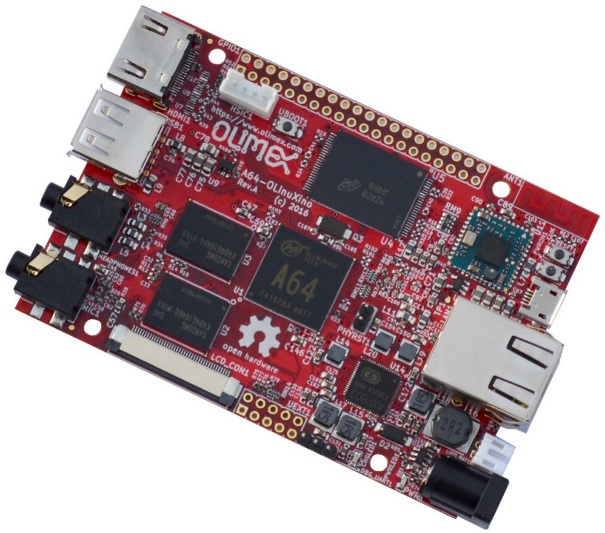

*Figura 31: A64-OLinuXino é um computador de placa única que roda Linux e Android*

A64-OLinuXino Olimex A64-OlinuXino é um computador de placa única que roda Linux e Android. O design é baseado em uma CPU ARM de 64 bits e inclui 1 ou 2 GB DDR3 RAM, 4 GB de memória flash, soquete para cartão microSD, WiFi e BLE4.0, Ethernet, HDMI e saída de áudio.

Uma câmera infravermelha de imagem térmica de código aberto CircuitoDigest Com o objetivo de tornar a Câmera Térmica acessível para amadores e fabricantes, construímos esta câmera térmica DIY usando um microcontrolador ESP32 e um sensor térmico MLX90640. A câmera captura

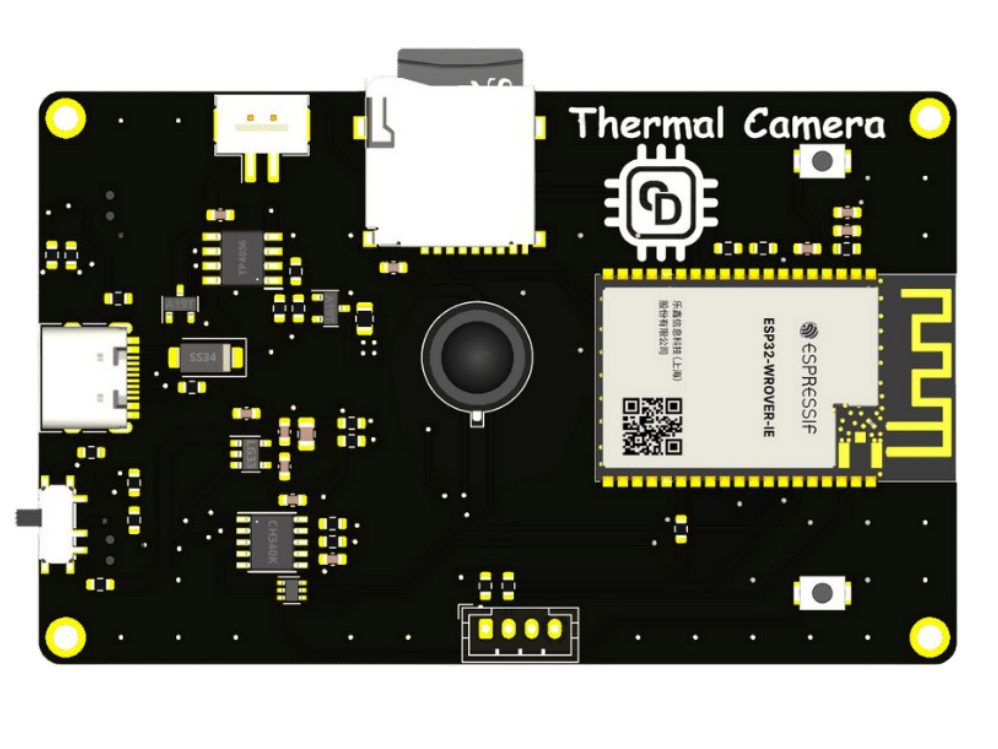

*Figura 32: Uma câmera infravermelha de imagem térmica de código aberto*

imagens térmicas com uma resolução de 32x24 pixels e possui uma tela de 2,4 polegadas para visualização. Ela oferece taxas de atualização ajustáveis, várias paletas de cores e recursos de medição de temperatura entre -40°C e 300°C.

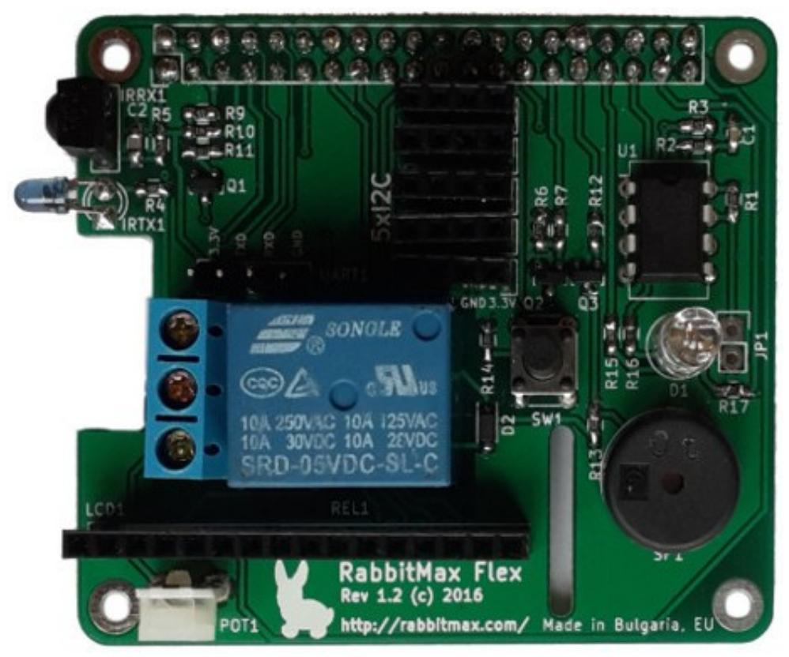

*Figura 33: ANAVI Flex é um Raspberry Pi Shield de código aberto para prototipagem de IoT e aplicações de automação residencial*

Shield Flex ANAVI Leon Anavi ANAVI Flex é um Shield Raspberry Pi de código aberto para prototipagem de IoT e aplicações de automação residencial. Ele tem receptor e transmissor infravermelho, relé, campainha, botão, LED RGB e pinos UART para depuração. A placa também suporta módulo de display LCD 1602 e até 5 sensores I2C

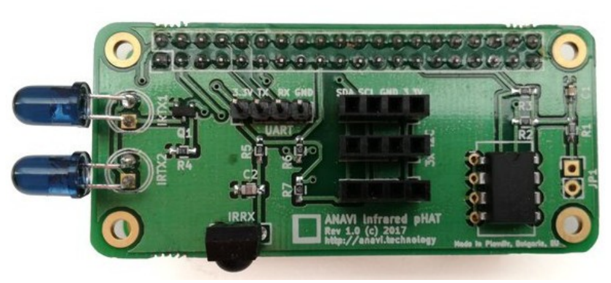

*Figura 34: ANAVI Infrared pHAT é uma placa adicional que converte o Raspberry Pi em um poderoso controle remoto*

ANAVI pHAT infravermelho Leon Anavi ANAVI Infrared pHAT é uma placa adicional que converte o Raspberry Pi em um poderoso controle remoto. Ela possui dois transmissores IR, receptor IR, três slots para módulos de sensor I2C, pinos UART para depuração e EEPROM com informações do fabricante da placa.

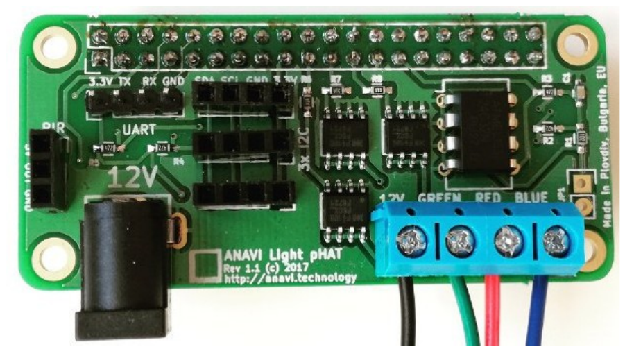

*Figura 35: ANAVI Light pHAT é uma placa add-on Raspberry Pi para controlar tiras de LED RGB de 12 V*

ANAVI pHAT leve Leon Anavi ANAVI Light pHAT é uma placa add- on Raspberry Pi para controlar tiras de LED RGB de 12 V. Além disso, tem três slots para módulos de sensor I2C, slot para sensor de movimento PIR, pinos UART para depuração e EEPROM com informações do fabricante da placa.

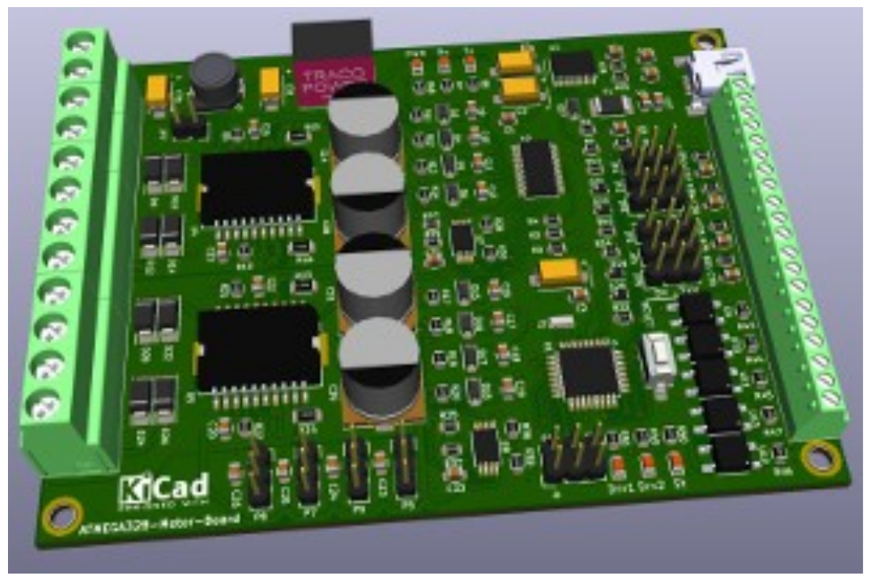

*Figura 36: controlador de motor de uso geral projetado com kicad em torno do microcontrolador ATmega328 e driver de motor L298P*

Placa ATMEGA328 para motor Antonio Morales Um controlador de motor de uso geral projetado com kicad em torno do microcontrolador ATmega328 e driver de motor L298P. Ele pode acionar quatro motores com várias opções de entrada.

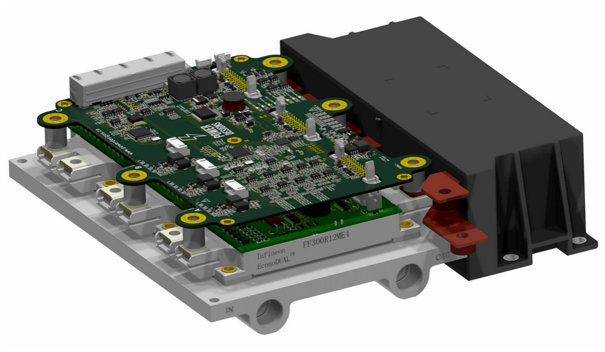

*Figura 37: Projetos de energia elétrica EV Inc. Axiom é um controlador de motor de 100kW+ de alta potência e alto desempenho baseado na plataforma VESC*

Controlador de motor Axiom Projetos de energia elétrica EV Inc. Axiom é um controlador de motor de 100kW+ de alta potência e alto desempenho baseado na plataforma VESC para compatibilidade com firmware e GUI. Ele é projetado para acionar IGBTs de 650V 600A e vem com muitos recursos de segurança.

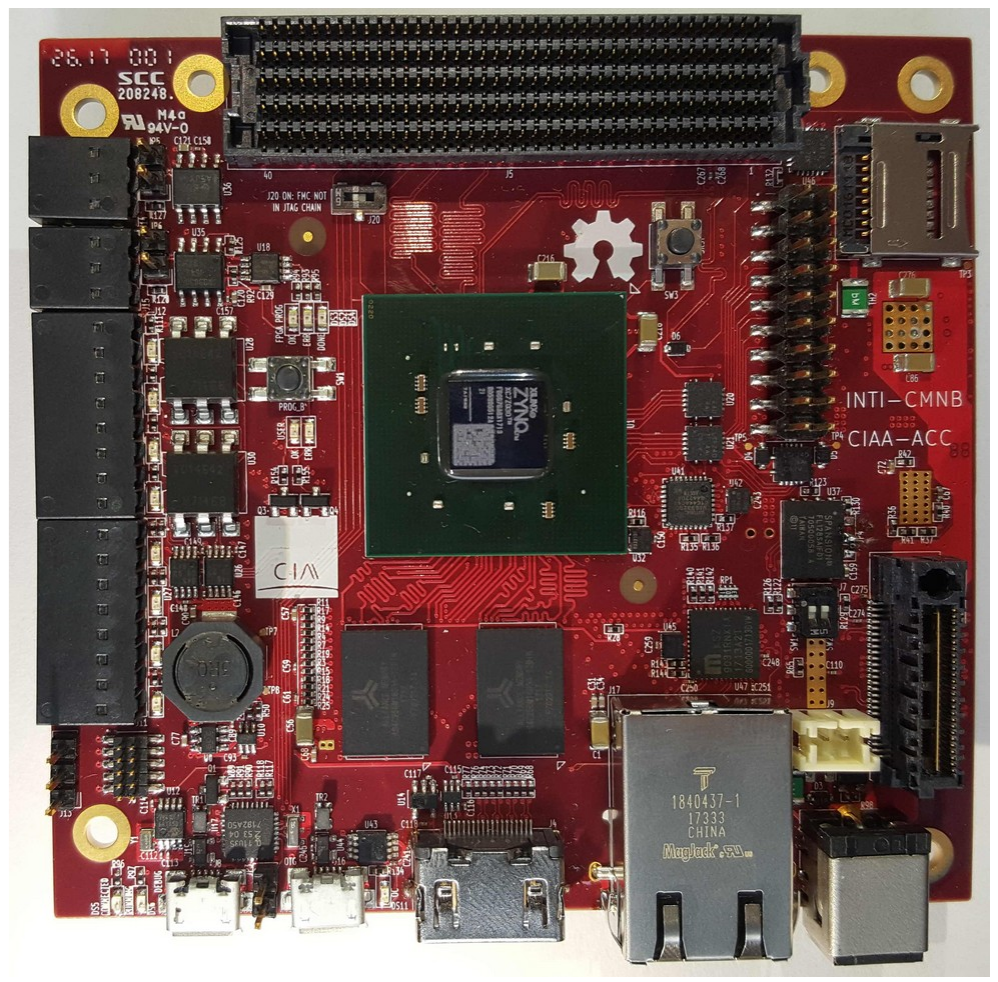

*Figura 38: O Projeto CIAA é um projeto de hardware e software aberto iniciado para alavancar o ambiente industrial argentino*

CIAA-ACC (HPC) O Projeto CIAA O Projeto CIAA é um projeto de hardware e software aberto iniciado para alavancar o ambiente industrial argentino. O CIAA-ACC é um projeto de PCB de 12 camadas para Computação de Alto Desempenho. Ele tem um Xilinx Zynq-7000 SoC com uma CPU ARM 2x Cortex A9 e um FPGA Kintex-7. O fator de forma é o PCIe-104 expansível. Periféricos: memória DDR3 de 1 GB, Quad SPI Flash, Gbit Ethernet, Micro SDHC, USB 2.0, HDMI de dupla função, PCIe 1x

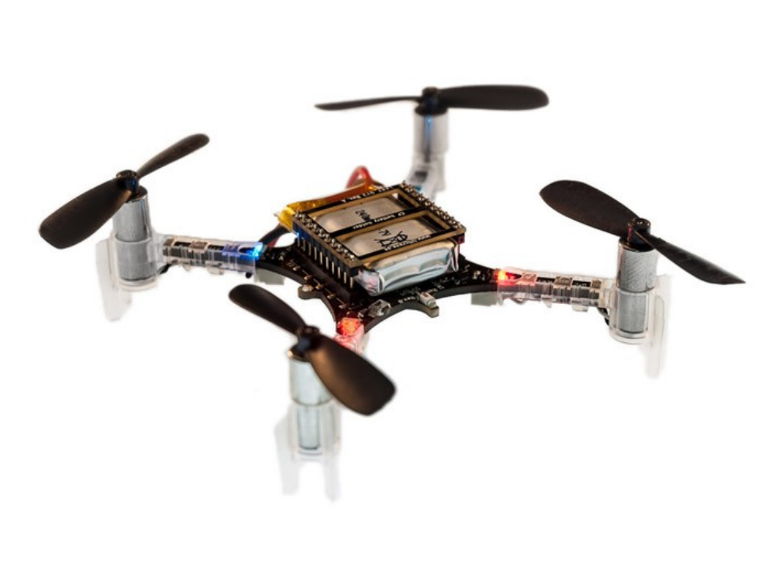

*Figura 39: O Crazyflie 1.0 é uma plataforma de desenvolvimento de voo aberto*

Crazyflie 1.0 Bitcraze AB O Crazyflie 1.0 é uma plataforma de desenvolvimento de voo aberto. É uma plataforma versátil que inclui um poderoso MCU Cortex-M4, rádio de baixa latência de 2,4 GHz e bluetooth de baixa energia. Ele também tem uma porta de expansão que permite adicionar facilmente hardware extra.

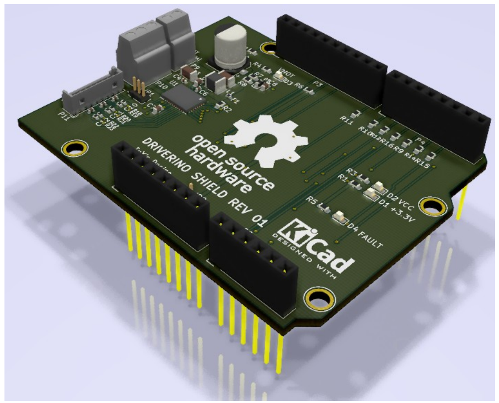

*Figura 40: Driverino-Shield é um controlador simples e de baixo consumo para motores BLDC sensorizados*

Shield Driverino Michele Santucci Driverino-Shield é um controlador simples e de baixo consumo para motores BLDC sensorizados. O objetivo do projeto era criar um shield Arduino capaz de acionar um motor PM BLDC com potência de cerca de 50-100 W. A placa é equipada com driver TI MCT8316Z BLDC.

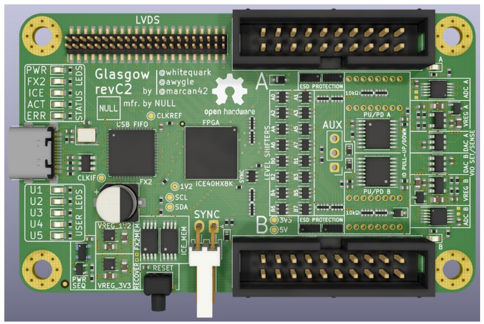

*Figura 41: Glasgow é uma ferramenta para explorar interfaces digitais, destinada a desenvolvedores embarcados, engenharia reversa e outras utilidades*

RevC de Glasgow Catarina 'quark branco' Glasgow é uma ferramenta para explorar interfaces digitais, destinada a desenvolvedores embarcados, engenharia reversa, arquivamento digitais, entusiastas de eletrônica e todos os outros que desejam se comunicar com uma ampla seleção de dispositivos digitais com alta confiabilidade e o mínimo de complicações.

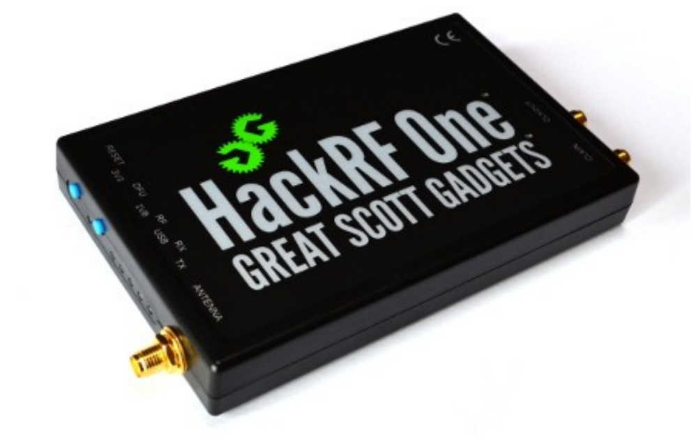

*Figura 42: HackRF One da Great Scott Gadgets é um periférico de Rádio Definido por Software capaz de transmitir ou receber sinais de rádio de 1 MHz a 6 GHz*

HackRF Grandes Gadgets Scott HackRF One da Great Scott Gadgets é um periférico de Rádio Definido por Software capaz de transmitir ou receber sinais de rádio de 1 MHz a 6 GHz. Projetado para permitir testes e desenvolvimento de tecnologias de rádio modernas e de próxima geração, HackRF One é uma plataforma de hardware de código aberto que pode ser usada como um periférico USB ou programada para operação autônoma.

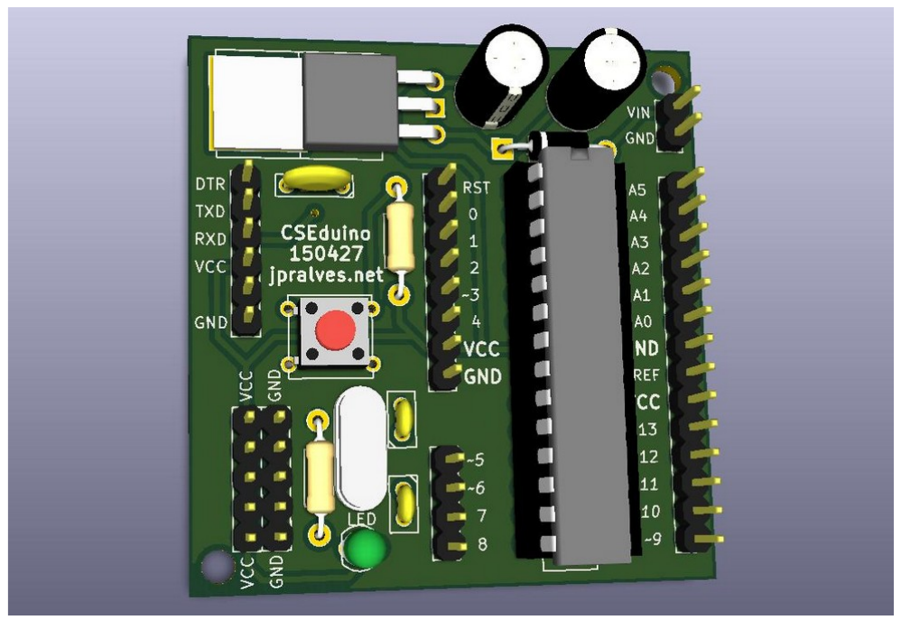

*Figura 43: CSEduino é a resposta para uma placa DIY Arduino de custo muito baixo*

CSEduino v4 João Alves CSEduino é a resposta para uma placa DIY Arduino de custo muito baixo. Esta versão tem um pcb de 2 camadas criado com kicad.

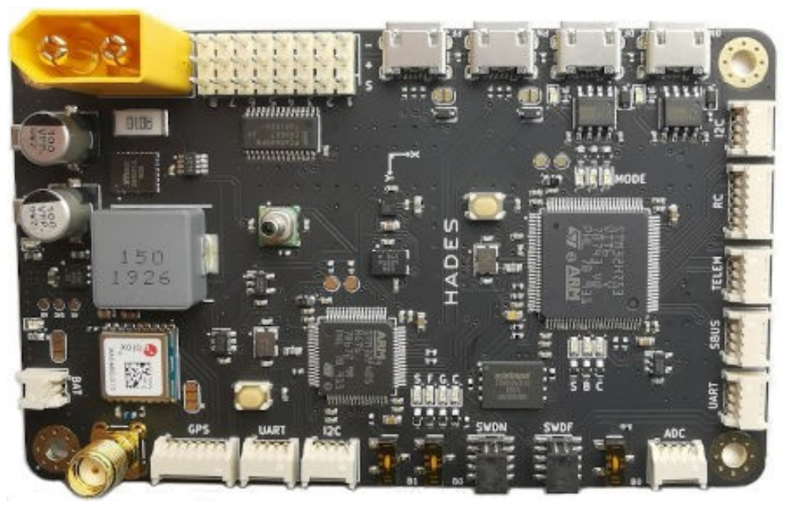

*Figura 44: HADES FCS é um sistema de controle de voo de código aberto para veículos aéreos não tripulados (UAVs) projetado completamente do zero*

Sistema de controle de voo HADES Filipe Salmony HADES FCS é um sistema de controle de voo de código aberto para veículos aéreos não tripulados (UAVs) projetado completamente do zero. Isso inclui o hardware (PCBs de controle de voo personalizados), firmware STM32 (usando FreeRTOS), filtragem de Kalman para estimativa de estado, algoritmos de controle, estação base, protocolo de comunicação, simulador de voo, processamento de sinal e muito, muito mais.

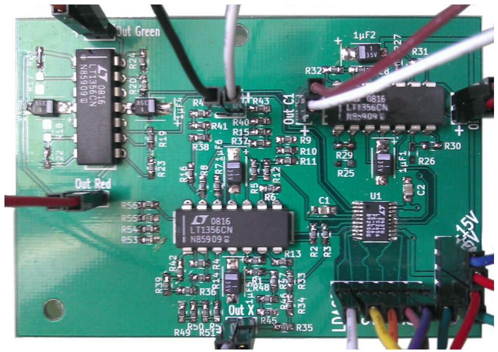

*Figura 45: O JEMTech-ILDA-Node é um DAC de 16 bits e 6 canais para ILDA de até 400 kpps*

JEMTech-ILDA-Node Jan-Erik Matthies O JEMTech-ILDA-Node é um DAC de 16 bits e 6 canais para ILDA de até 400 kpps. Este Projeto é um DAC (conversor digital para analógico) que gera seis sinais diferenciais com base no padrão ILDA (International Laser Display Association) ISP-DB25. O DAC é controlado via barramento SPI (Serial Peripheral Interface).

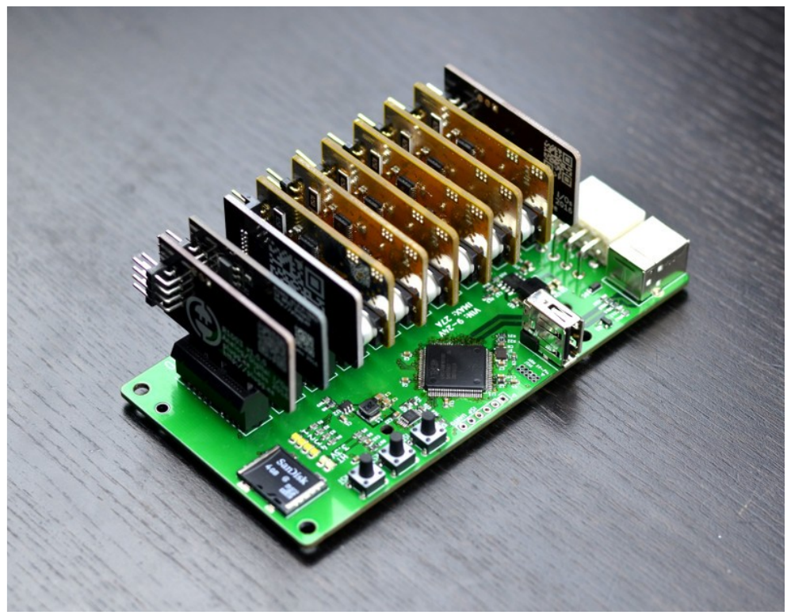

*Figura 46: Quadro Suculento-JuicyBoard do plugg.ee Labs é uma plataforma de robótica modular de código aberto que pode ser usada para construir impressoras 3D personalizadas, máquinas CNC e muito mais*

Quadro Suculento Laboratórios plugg.ee JuicyBoard do plugg.ee Labs é uma plataforma de robótica modular de código aberto que pode ser usada para construir impressoras 3D personalizadas, máquinas CNC e muito mais.

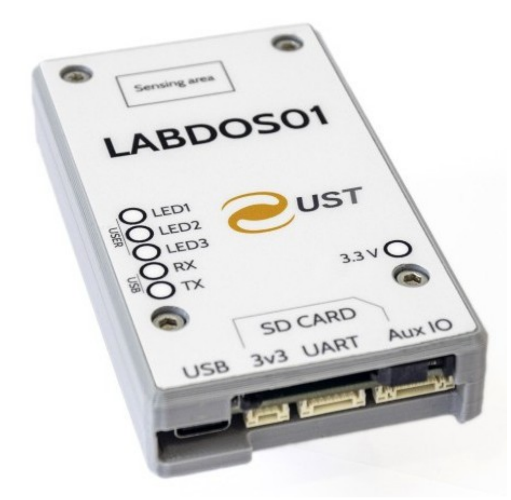

*Figura 47: LABDOS-espectrômetro de radiação ionizante*

LABDOS-espectrômetro de radiação ionizante baseado em semicondutores Tecnologias Científicas Universais sro (UST) LABDOS01 é um espectrômetro- dosímetro de código aberto baseado em um diodo PIN de silício e é destinado a pesquisas científicas e propósitos experimentais. Uma porta USB-C ou conector JST-GH protege a energia e a comunicação. O dispositivo pode ser usado estaticamente (localizado em um local específico, por exemplo, laboratório ou base) ou em aplicações móveis (como carros ou UAVs). O espectrômetro é alojado em uma caixa impressa em 3D, que traz resistência mecânica essencial e permite o desenvolvimento futuro de

gabinetes de usuário e novas integrações. O objetivo do LABDOS01 é criar um dispositivo de medição de código aberto, acessível, de alta qualidade, confiável e simples — um espectrômetro de energia de radiação para a comunidade científica.

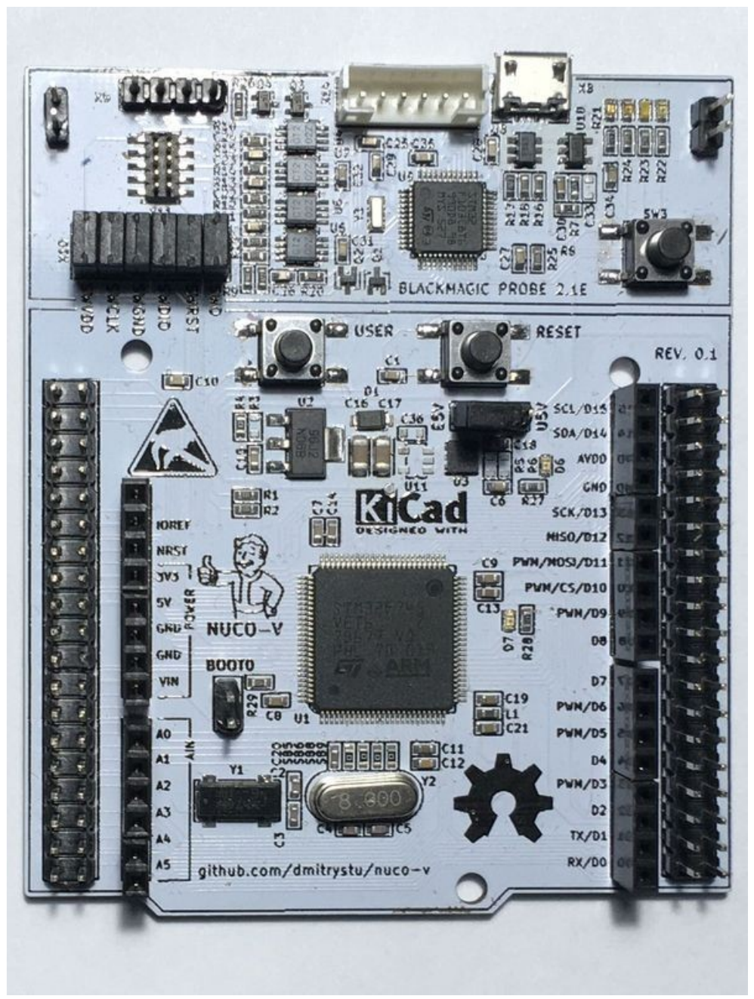

*Figura 48: NUCO-V-placa de desenvolvimento compatível com NUCLEO-64© para as séries STM32F7 e STM32H7 com Black Magic Probe integrado*

NUCO-V Dmitry Filimonchuk NUCO-V é uma placa de desenvolvimento compatível com NUCLEO-64© para as séries STM32F7 e STM32H7 com Black Magic Probe integrado

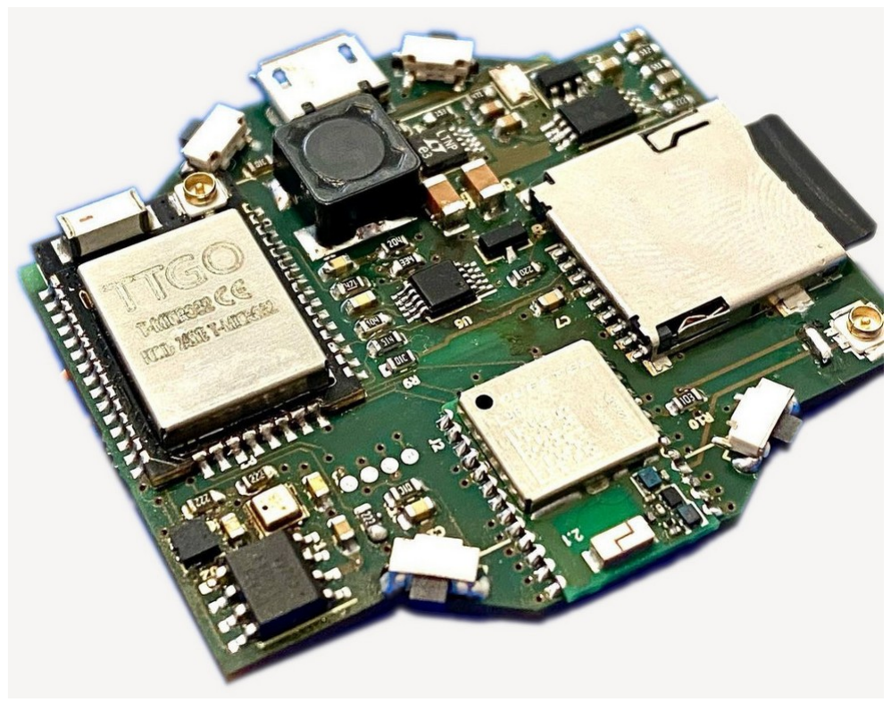

*Figura 49: Open Smartwatch é um relógio inteligente completamente aberto (ECAD/MCAD e software)*

Smartwatch aberto pauls_coisas_3d Open Smartwatch é um relógio inteligente completamente aberto (ECAD/MCAD e software). O objetivo é construir um smartwatch de código aberto, com rastreamento por GPS e mapas. Os recursos incluem: ESP32, GPS, Time, sensores MEMS, bateria de íons de lítio, USB serial e armazenamento em cartão microSD.

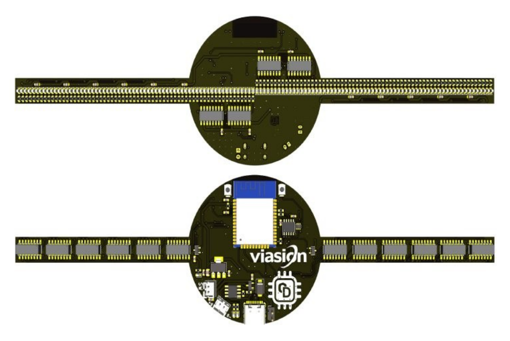

*Figura 50: display POV de código aberto com resolução de 128 pixels e uma taxa de quadros máxima de 20 FPS*

Exibição POV de código aberto usando ESP32 Jóbito José Um display POV de código aberto com resolução de 128 pixels e uma taxa de quadros máxima de 20 FPS. Este display é capaz de exibir imagens e animações. O display é construído em torno do ESP32 SoC e usa registradores de deslocamento 74HC595 para controlar cada pixel. Também criamos uma ferramenta da web, que converterá cada imagem em uma matriz que precisa de apenas aproximadamente 2 KB de espaço de código para cada imagem. Isso faz com que seja possível integrar facilmente vários números de imagens no código sem se preocupar com a limitação de armazenamento.

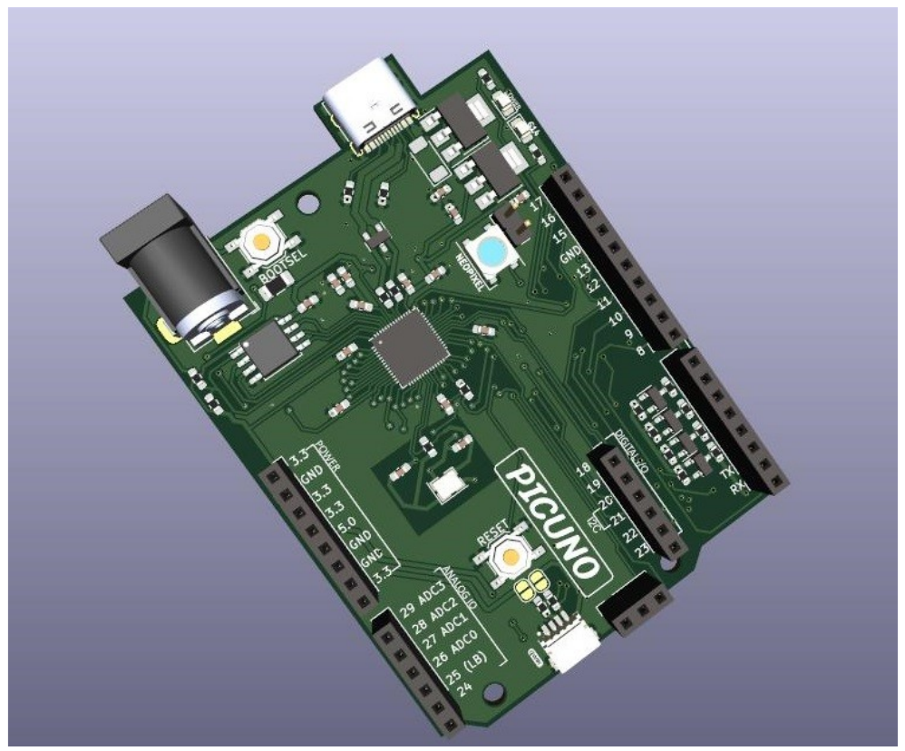

*Figura 51: O Picuno é a mistura do RP2040 e do Arduino UNO*

Picuno Atul Ravi O Picuno é a mistura do RP2040 e do Arduino UNO. Um substituto para o UNO compatível com derivados C e python.

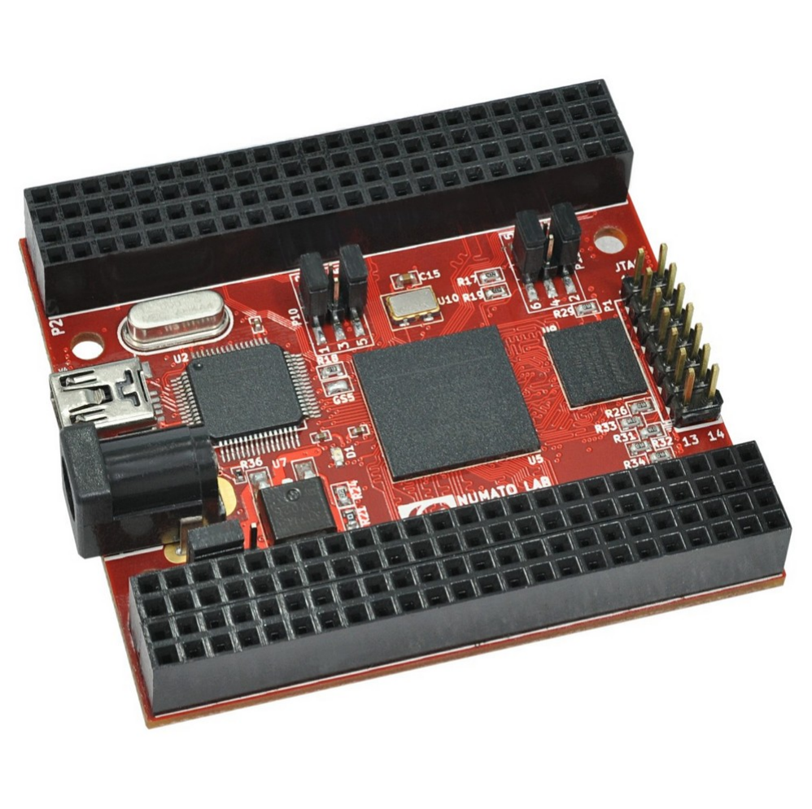

*Figura 52: Saturn é uma placa de desenvolvimento FPGA fácil de usar com Xilinx Spartan-6 FPGA*

Saturno Numato Saturn é uma placa de desenvolvimento FPGA fácil de usar com Xilinx Spartan-6 FPGA. Saturn é especialmente projetada para experimentar e aprender design de sistemas com FPGAs. Esta placa de desenvolvimento apresenta FPGA da série Xilinx XC6SLX com dispositivo USB de canal duplo FT2232H da FTDI. A interface USB 2.0 de alta velocidade fornece download de configuração rápido e fácil para o flash SPI integrado. Nenhum programador ou cabo de downloader especial é necessário para baixar o fluxo de bits para a placa.

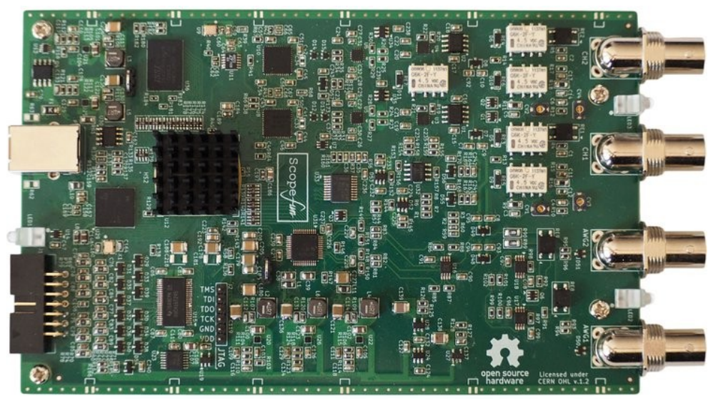

*Figura 53: ScopeFun é uma plataforma de instrumentação tudo-em-um de código aberto*

ScopeFun Dejan Priversek e David Kosenina ScopeFun é uma plataforma de instrumentação tudo-em-um de código aberto. Inclui um osciloscópio, gerador de forma de onda arbitrária, analisador de espectro, analisador lógico e gerador de padrão digital.

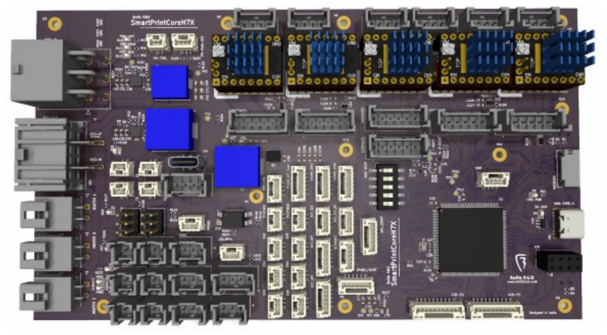

*Figura 54: SmartPrintCoreH7x-controladora 3D*

SmartPrintCoreH7x Boltz P&D Mergulhe no coração da inovação com o SmartPrintCoreH7x, uma inovadora placa-mãe de impressora 3D de código aberto projetada com paixão pela comunidade e um foco claro em durabilidade, confiabilidade e facilidade de uso. Nascida de uma visão para capacitar fabricantes, inventores e engenheiros ao redor do mundo, a SmartPrintCoreH7x se prepara para se tornar um farol de desenvolvimento colaborativo no mundo da impressão 3D

#### Dosímetros SPACEDOS

Tecnologias Científicas Universais sro (UST)

Os dosímetros SPACEDOS são espectrômetros e dosímetros de radiação ionizante baseados em detectores semicondutores <u>de código aberto</u>. Eles já

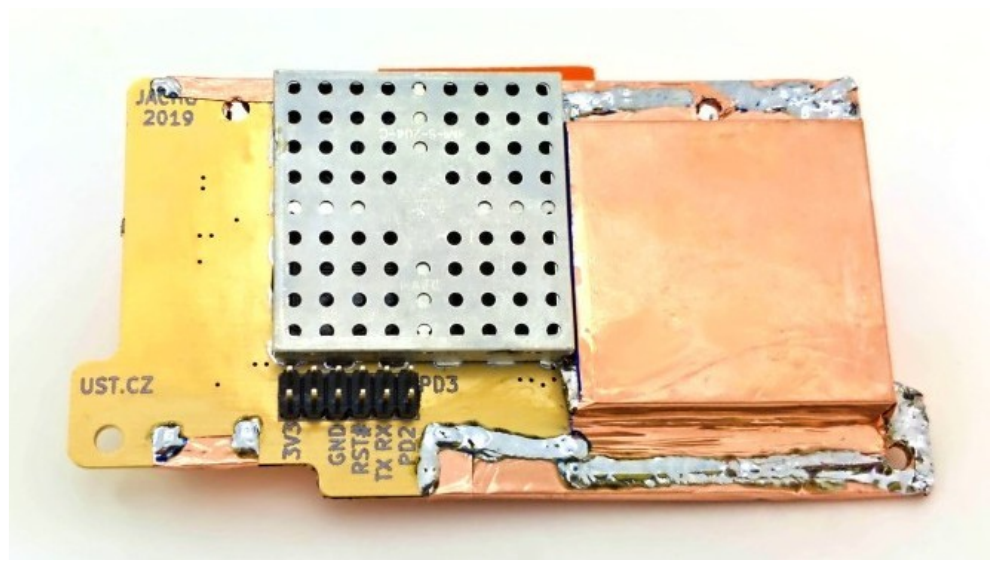

*Figura 55: dosímetros SPACEDOS são espectrômetros e dosímetros de radiação ionizante baseados em detectores semicondutores de código aberto*

participaram com sucesso de várias

*espectrômetros e dosímetros de radiação*

missões espaciais. O SPACEDOS02 mede,

*ionizante baseados em detectores*

*semicondutores de código aberto.*

por um período de troca regular de tripulação com duração de vários meses, a bordo da Estação Espacial Internacional (ISS). O dosímetro SPACEDOS01 foi modificado para montagem dentro de CubeSats e foi enviado para a órbita da Terra como parte do satélite SOCRAT-R.

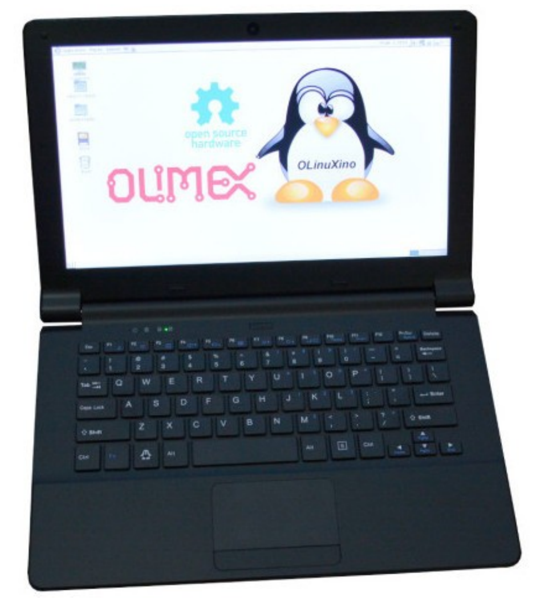

*Figura 56: O TERES I é um laptop de hardware e software de código aberto*

Teres I Olimex O TERES I é um laptop de hardware e software de código aberto do tipo "faça você mesmo" com processadores ARM64 e x86, incluindo arquivos MCAD.

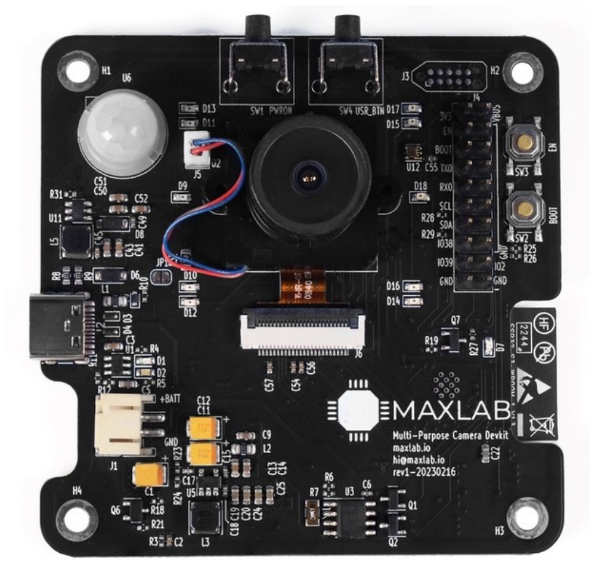

*Figura 57: Tokay Lite: Câmera ESP32 Edge AIMAXLAB.IO*

Tokay Lite: Câmera ESP32 Edge AI MAXLAB.IO Tokay Lite é a placa de desenvolvimento de câmera ESP32 ideal para aplicações de processamento de imagem de baixo consumo de energia na borda. O Tokay Lite pode ser usado como um devkit independente para auxiliar desenvolvedores com uma ferramenta conveniente ou ser incorporado a um sistema maior para aumentá-lo com dados de visão e processamento de imagem.

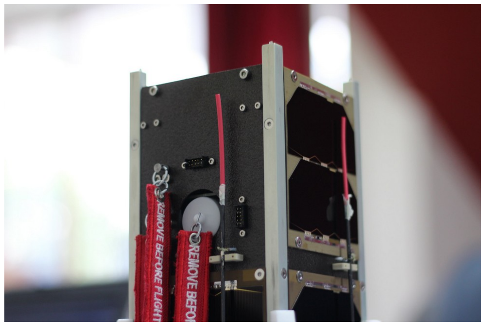

*Figura 58: O primeiro satélite da UPSat Cubesat 2U construído e entregue pela Libre Space*

UPSat Fundação Espaço Livre O primeiro satélite de código aberto O UPSat é um satélite Cubesat 2U construído e entregue pela Libre Space Foundation, iniciado pela Universidade de Patras como parte da missão upsatQB50 com ID GR-02.

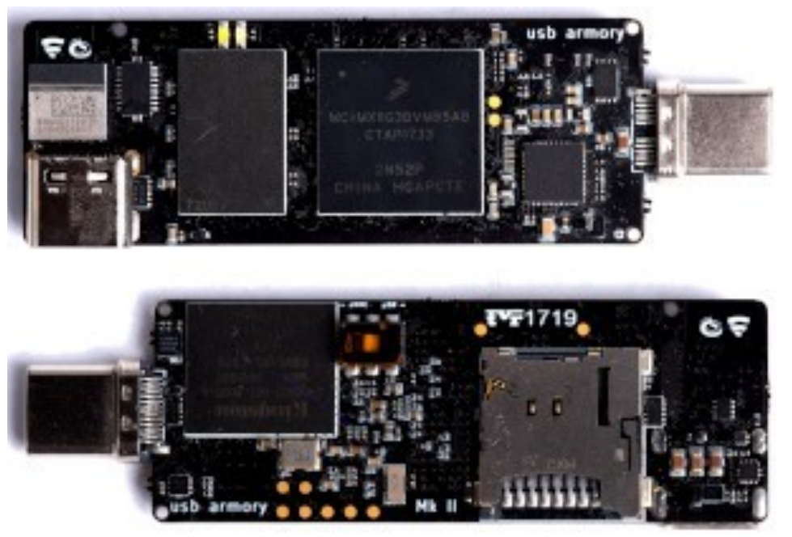

*Figura 59: O arsenal USB 2 da Inverse Path é um projeto de hardware de código aberto que implementa um computador do tamanho de um pen drive*

Armaria USB Mk II Caminho inverso / F-Secure O arsenal USB da Inverse Path é um projeto de hardware de código aberto que implementa um computador do tamanho de um pen drive. O dispositivo compacto alimentado por USB fornece uma plataforma para desenvolver e executar uma variedade de aplicativos.
