# 9. Controle de impedância em circuitos de alta frequência

O **controle de impedância** no design de PCBs é essencial em projetos que envolvem sinais de alta frequência ou transmissão de dados em alta velocidade. Ele garante que as características elétricas das trilhas estejam adequadas para preservar a integridade do sinal, minimizar perdas e evitar reflexões ou interferências.

### 9.1. Importância do controle de impedância

1. **Integridade do Sinal**: Garante que o sinal transmitido não se degrade ao
longo das trilhas, especialmente em frequências altas.

2. **Redução de Reflexões**: Impedâncias inadequadas causam reflexões de
sinal, o que pode introduzir ruídos e dificultar a comunicação.

3. **Minimização de Crosstalk**: Trilhas próximas com impedância
desbalanceada podem gerar interferências entre si.

4. **Conformidade com Padrões**: Muitas interfaces, como USB, Ethernet e
HDMI, exigem controle de impedância para atender especificações.

### 9.2. Exemplos de casos onde é necessário o controle de impedância

1. **Linhas Diferenciais**: Interfaces como USB, Ethernet, PCIe e HDMI
requerem pares de trilhas com impedância controlada (tipicamente 90 Ω ou 100 Ω).

2. **Sistemas RF (Rádio Frequência)**: Trilhas para antenas ou sinais de
comunicação sem fio, como Wi-Fi e LoRa, precisam de impedância controlada (tipicamente 50 Ω).

3. **Roteamento de Clock e Dados de Alta Velocidade**: Linhas de sinal para
memórias DDRx ou barramentos de alta velocidade como SPI e LVDS.

4. **Redes de Comunicação Industrial**: Interfaces como CAN e RS485
dependem de impedância consistente para evitar falhas.

### 9.3. Consequências da Falta de Controle de Impedância

1. Perda de Dados: Em interfaces digitais, sinais distorcidos podem causar erros de transmissão e recepção.
2. Ruído e Interferências: Reflexões nos sinais podem gerar interferência eletromagnética (EMI).
3. Falhas no Circuito: Sistemas RF podem perder potência ou sofrer desajustes na frequência de operação.
4. Desempenho Degradado: Em circuitos de alta velocidade, sinais com alta distorção podem prejudicar a eficiência do sistema.
## 9.4. Controle de impedância com Kicad

A USB será utilizada como exemplo para o entendimento de como realizar o controle de impedância.

::: {.quadro tipo="importante" titulo="Impedância do par diferencial USB"}
O **USB 2.0** exige **90 Ω ±15%** no par diferencial. O valor de **±10%** que aparece em calculadoras de fabricante é a *tolerância de fabricação* da impedância controlada — a JLCPCB, por exemplo, declara ±10% — e não o requisito da interface. Ao criar a classe de rede no KiCAD, use o valor e a tolerância da interface que está sendo roteada.

*Fontes: Texas Instruments, "USB layout basics"; JLCPCB, "PCB Manufacturing & Assembly Capabilities" (consultado em 2026-09-29).*
:::

**1.. PASSO** Previamente, no editor do esquemático, é necessário identificar com Label as
trilhas que terão controle de impedância. Observe os dois exemplos das figuras onde as trilhas são identificadas com USB_D+ e USB_D- e no segundo exemplo classe DP_90R com rótulos pertencentes DP e DN. Os Label’s do par diferencial devem fazer parte de uma classe de rede que terão o controle de impedância. No KiCAD a identificação dos rótulos dias vias diferenciais deve ser finalizadas com +/- ou P/N.

Na USB geralmente são empregados diodos de proteção. O LESD5D5.0 é um diodo de proteção de rápidas resposta capaz de realizar o proteção contra EDS (Electrostatic Discharge Sensitivity) e transientes de tensão.

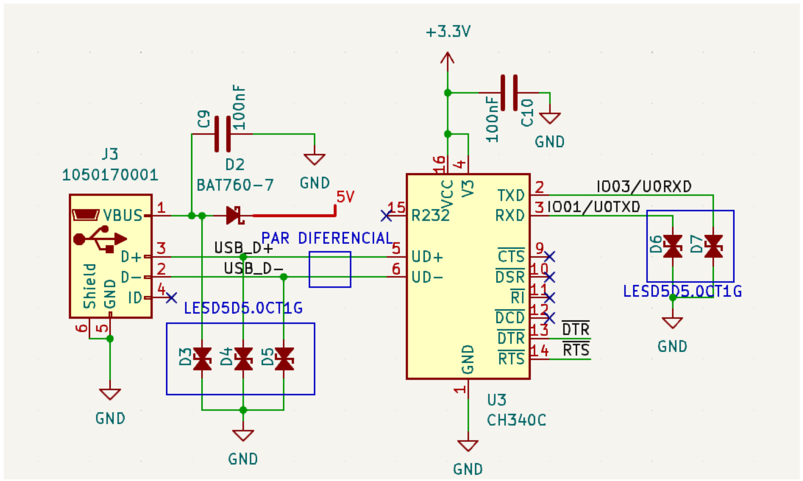

*Figura 60: Label nas trilhas de comunicação USB com diodos de proteção*

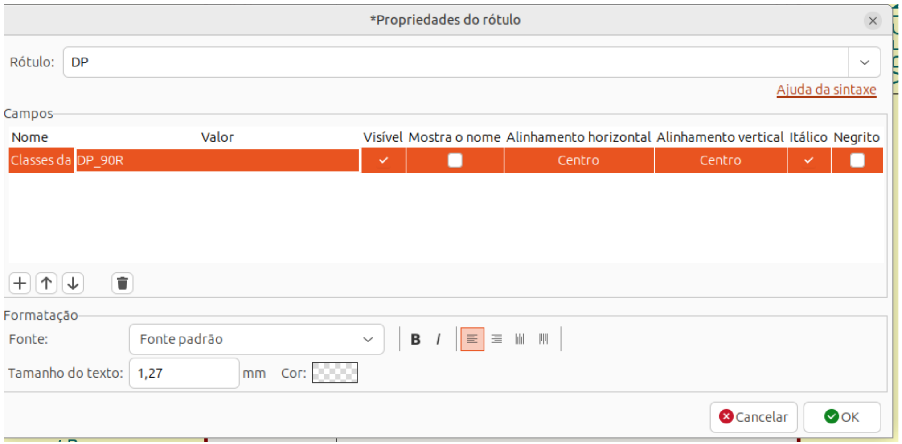

*Figura 61: Definição dos labels do par diferencial e atribuição a classe DP_90R*

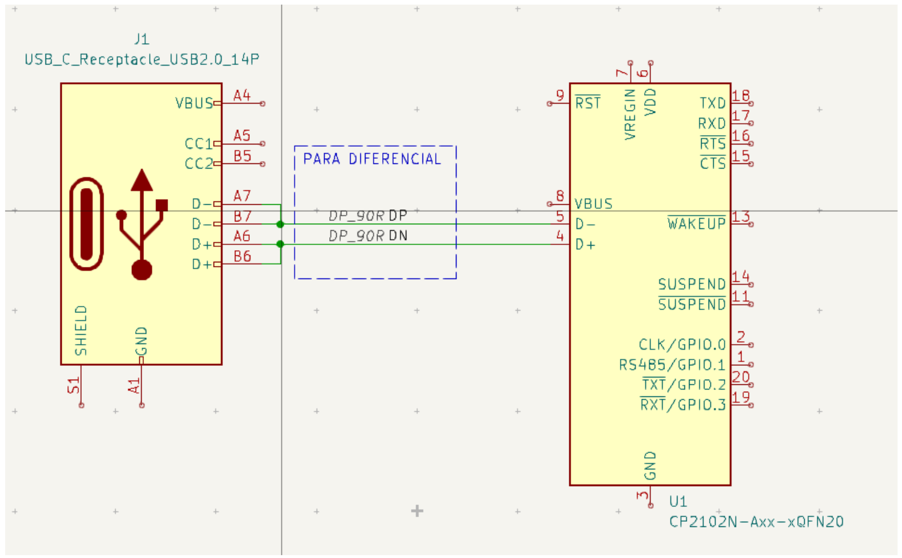

*Figura 62: Label nas trilhas de comunicação USB sem diodos de proteção*

controle de impedância. O caso apresentado trata da JLCPCB.

#### Acesse <u>[https://jlcpcb.com/pt/impedance](https://jlcpcb.com/pt/impedance)</u>

e verifique os parâmetros para multicamada. Os dados contidos nessa página serão importantes para uso posterior. A figura a seguir apresenta os parâmetros para PCB multicamada.

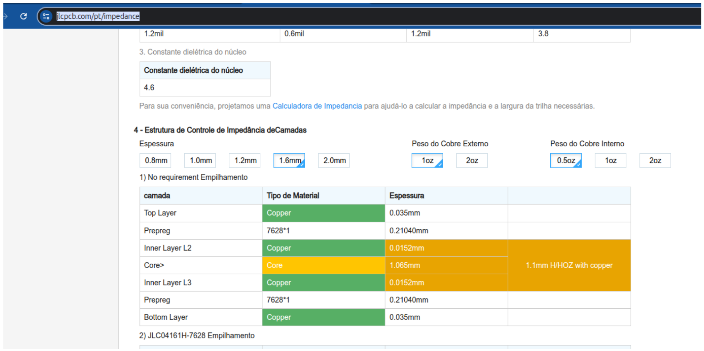

*Figura 63: Estrutura com parâmetros para o controle de impedância*

Esses parâmetros devem ser inseridos no KiCAD em configuração da placa conforme a figura a seguir.

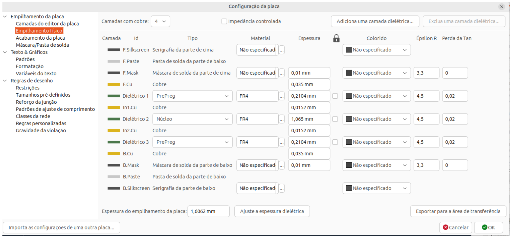

*Figura 64: Configuração da placa com edição dos parâmetros conforme compatibilidade da JLCPCB*

Pode-se também realizar o acesso pelo link contido na página de compatibilidades da JLCPCB

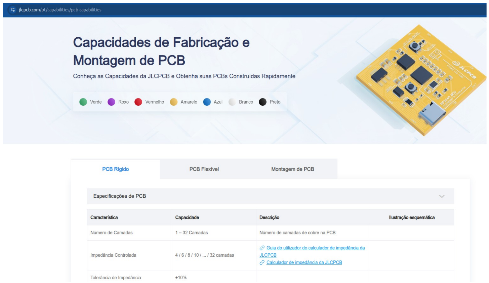

*Figura 65: Página de compatibilidades da JLCPCB. Link para guia e calculadora de impedância*

#### Troque a unidade para mm.

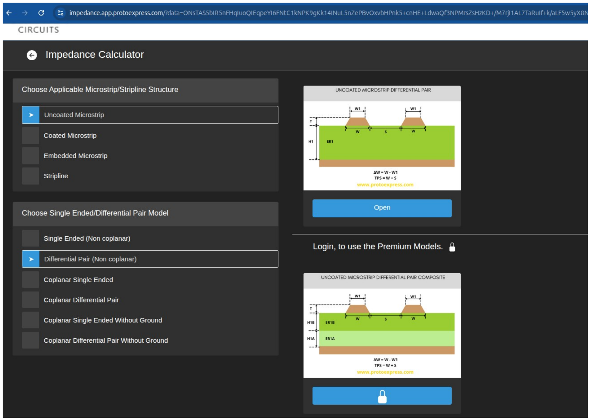

*Figura 66: Trilhas não revestidas (uncoated) par diferencial*

No site da JLC página do controle de impedância, obtenha a contante dielétrica do tipo de material Prepeg 7628 que corresponde a 4,4.

*Figura 68: Constantes dielétricas obtidas na páginas de controle de impedância do*

*JLCPCB*

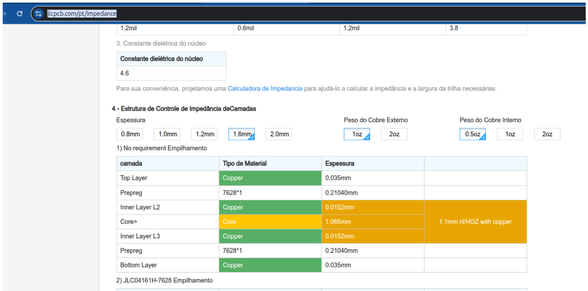

*Figura 67: Estrutura com parâmetros para o controle de impedância*

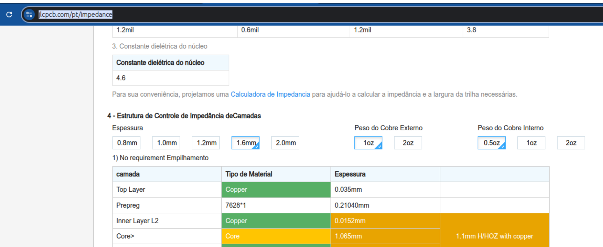

*Figura 68: Constantes dielétricas obtidas na páginas de controle de impedância do JLCPCB*

*Figura 67: Estrutura com parâmetros para o controle de impedância.*

Além da constante dielétrica obtenha a altura do material Prepeg 7628 (0,21040mm) conforme a figura anterior. Inclua na calculadora a distância entre trilhas (0,2 mm em Trace Separation (S) ( mm )) valor obtido na configuração da placa classe de rede DP_90R.

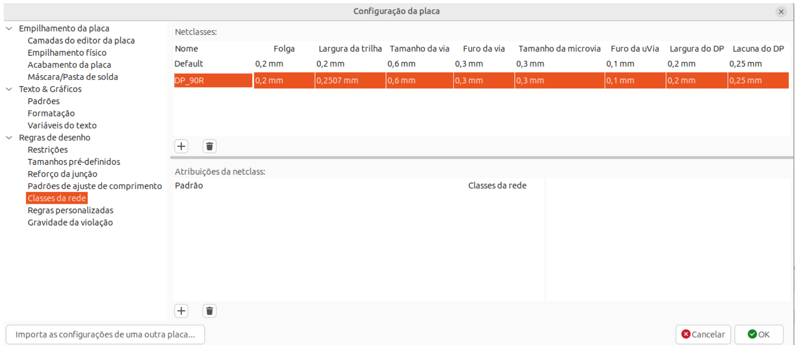

*Figura 69: Parâmetros da classe DP_90R*

Insira o valor de 90 ohms para a impedância alvo. Outros tipos de barramento possuem impedâncias próprias.

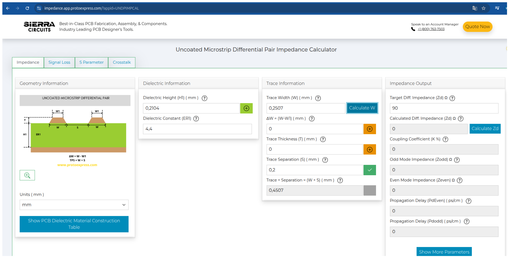

*Figura 70: Calculadora de impedância da Sierra Circuits*

Após selecionar a unidade para mm, preencher os parâmetros:

#### Altura do dielétrico: 0,2104 mm

Constante dielétrica para o material Prepeg 7628: 4,4

#### Separação entre trilhas: 0,2 mm

#### Impedância alvo: 90 ohms

Clique em **Calcular W** e será obtido o valor da largura da trilha.

Insira o valor calculado da trilha na classe DP_90R conforme a figura.

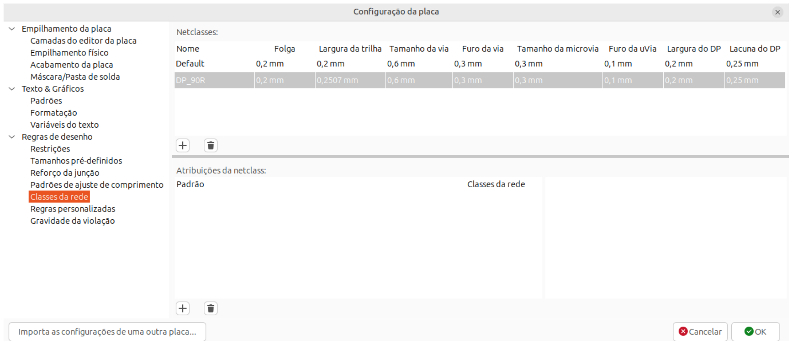

*Figura 71: Largura da trilha para a classe DP_90R*

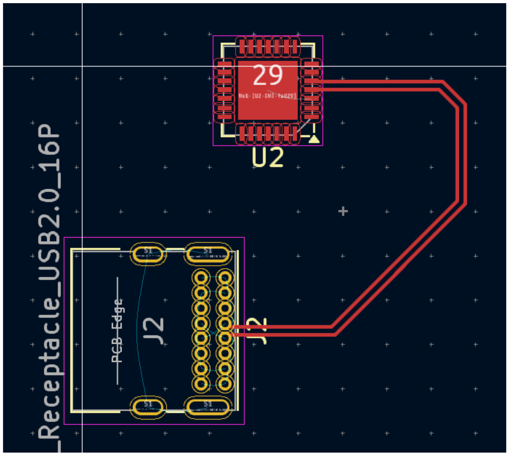

*Figura 72: Roteamento do par diferencial*

Devido a geometria das trilhas do par diferencial, mas mesmas não possuem o mesmo comprimento. Logo, será necessário realizar alguns ajustes para garantir que os sinais elétricos sejam recebidos no mesmo tempo.

Se houver uma diferença de comprimento (ou atraso), chamada de **skew**, isso pode causar:

- Jitter (variação temporal) no sinal.
- Degradação da imunidade a ruído (o modo comum não é cancelado corretamente).
- Erros de comunicação em altas frequências. Verifique o comprimento de cada trilha, para isso use **a tecla de atalho “7”.**
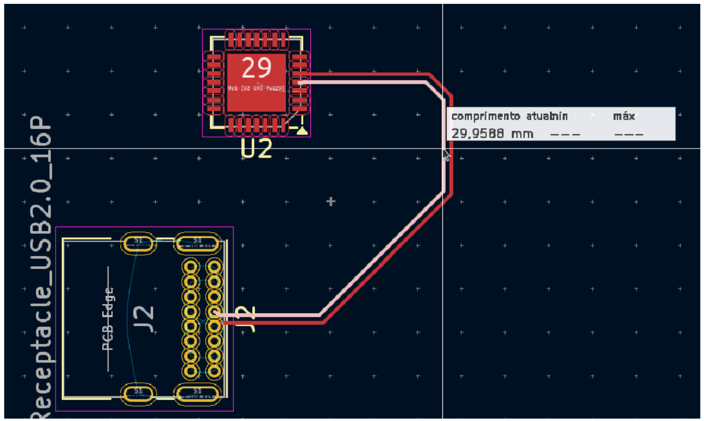

*Figura 73: Comprimento da trilha do par diferencial*

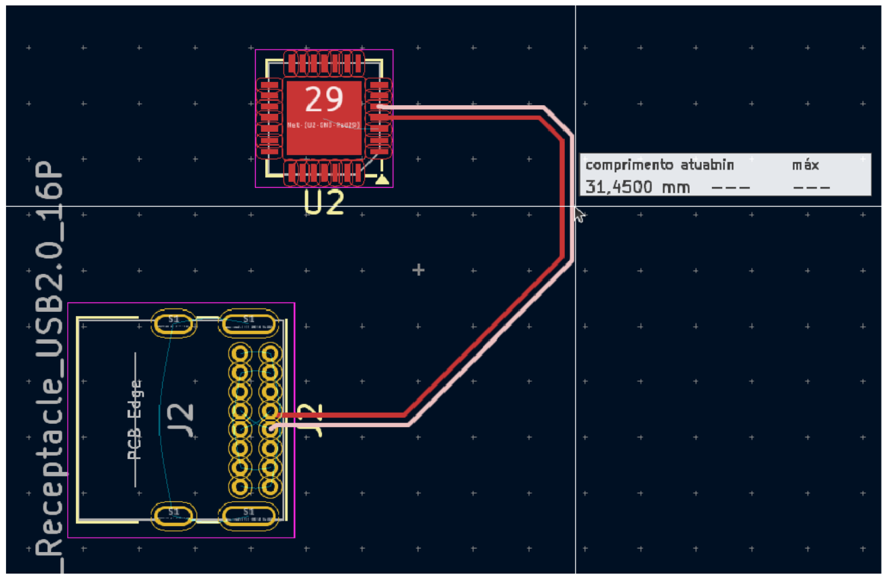

*Figura 74: Comprimento da trilha do par diferencial*

 Conforme as figuras anteriores, pode-se observar que as trilhas possuem
comprimentos de 31,45 mm e 29,9588 mm. Deve-se preceder com os ajuste de comprimento para equalização.

Use a **tecla de atalho “8”**, para clique com o botão direito do mouse na maior trilha e selecione ***Configurações do ajuste de comprimento***. Observe a figura a seguir.

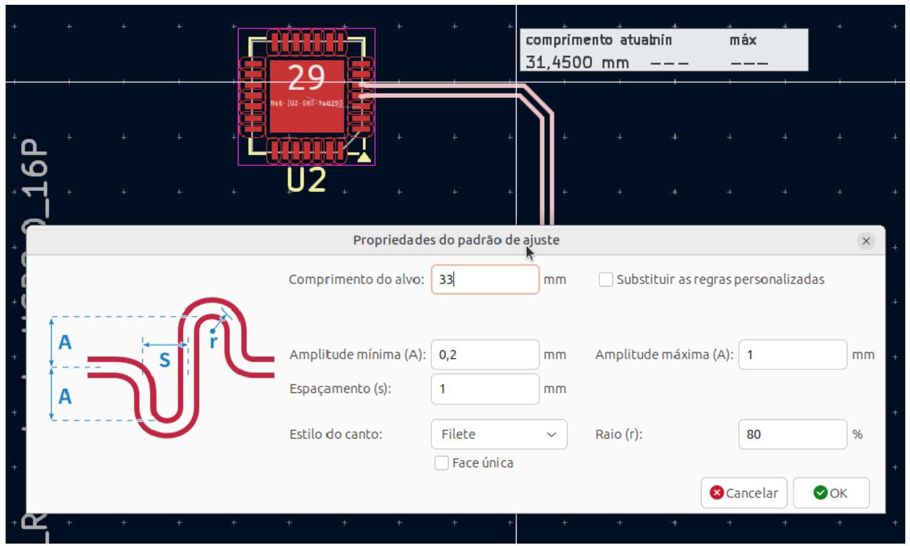

*Figura 75: Ajuste do comprimento desejado*

Defina o comprimento alvo igual o comprimento da maior trilha ou pouco superior, no exemplo o valor é de 33 mm.

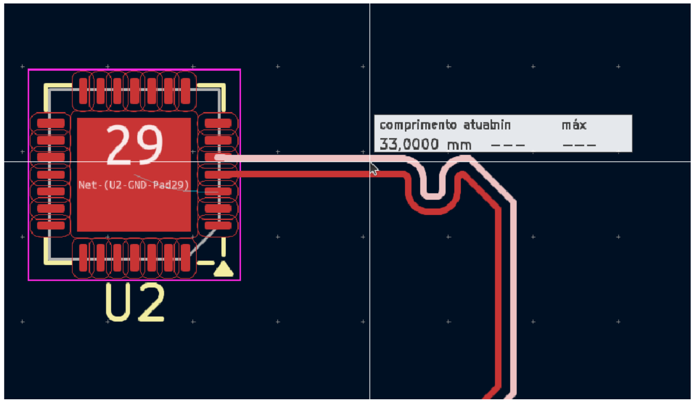

*Figura 76: Maior trilha com comprimento 33*

A tecla de atalho 7 deverá ser usada para o ajuste de comprimento da outra trilha.

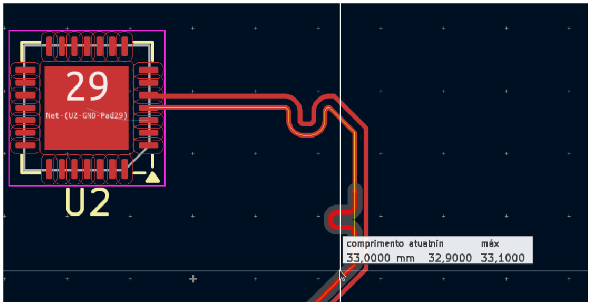

*Figura 77: Ajuste de comprimento da trilha*

A figura a seguir apresenta resultado final cujo comprimento de cada trilha é de 33mm.

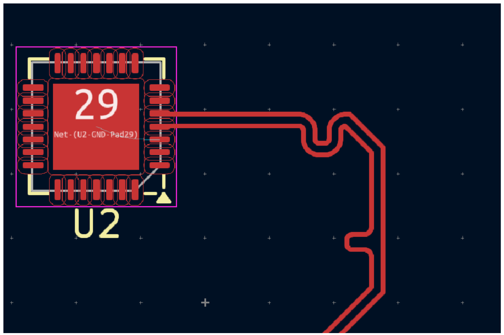

*Figura 78: Trilhas par diferencial com comprimentos iguais e impedância ajustada*
