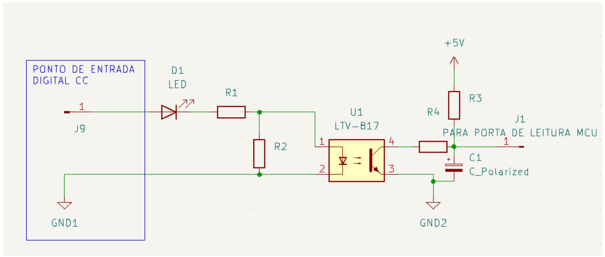
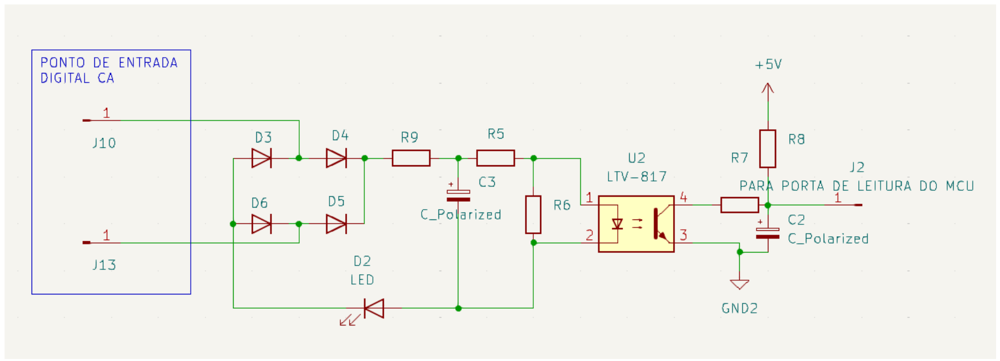
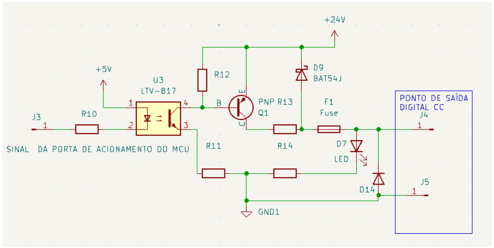
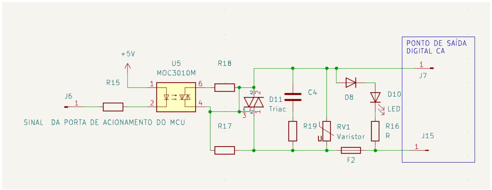
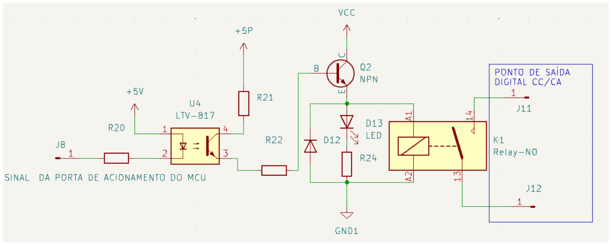

# 10. Circuitos para interfaceamento de entrada e saída digital com microcontrolador

As entradas e saídas digitais atuam como interface entre o MCU e os transdutores ou atuadores no campo. Há diversas formas de projetar os circuitos de entrada e saída, adaptáveis aos diferentes sinais utilizados.

## 10.1. Entradas digitais em C.C.

Detectam e convertem sinais de comutação de entrada em níveis lógicos de tensão usados na porta digital do MCU. Os módulos de entradas e saídas digitais podem ser projetados para trabalhar tanto com sinais de tensão contínua, quanto sinais alternados. Para os níveis de C.C., o padrão industrial adotado é de 24 V, o qual possui uma relação sinal/ruído adequada para ambientes industriais e 110 e 220 V, para níveis CA. A figura a seguir apresenta um exemplo esquemático para sinal da entrada digital.

*Figura 79: Exemplo esquemático para sinal discreto de campo tipo P*

Um aspecto importante a ser considerado no esquema das entradas é que a parte lógica do circuito é desacoplada do sinal de entrada através de um acoplador óptico, o que assegura a integridade do circuito, caso ocorram problemas com o sinal de entrada, além de aumentar a imunidade a ruídos do sistema.

No fotoacoplador existe um filtro formado por C1, R3 e R4, este filtro fará com que ruídos existentes na alimentação, típicas de ambientes de redes elétricas industriais, não causem um acionamento indevido na porta do MCU, devido ao filtro, normalmente as entradas digitais não deverão responder a uma freqüência maior que 1 kHz, exceto naquelas entradas especiais de contadores rápidos.

## 10.2. Entradas digitais em C.A.

Semelhante às entradas de corrente contínua, as entradas digitais de corrente alternada leem sinais do processo, oferecendo a vantagem de permitir maior distância entre o MCU e o transdutor devido à melhor relação sinal/ruído em tensões de 110 V ou 220 V. Geralmente, em distâncias superiores a 50 m em ambientes ruidosos, é recomendável considerar o uso de entradas CA. Contudo, ao trabalhar com níveis de tensão alternada, é fundamental adotar cuidados extras com a isolação geral da instalação para garantir segurança e confiabilidade.

*Figura 80: Exemplo esquemático para sinal CA discreto de campo*

## 10.3. Saída digitais em C.C.

No exemplo do esquemático deve-se ligar a carga entre o potencial negativo da fonte de alimentação de 24 VCC e o ponto de saída (J4 e J5). A figura a seguir exemplifica o circuito de uma saída digital tipo P.

*Figura 81: Exemplo esquemático para saída digital CC*

## 10.4. Saída digitais em C.A. com TRIAC

A saída em corrente alternada pode ser usado para acionar diretamente bobinas de contatores CA ou outra carga conforme os dimensionamento dos circuitos de saída. A alimentação normalmente é do tipo full range, ou seja, é possível ligar cargas cuja alimentação esteja entre 90 VAC a 240 VAC. A figura a seguir exemplifica o circuito de uma saída digital em corrente alternada.

*Figura 82: Exemplo esquemático para saída digital com acionamento de carga CA. 97*

No exemplo do circuito pode-se observar alguns elementos importantes:

- Varistor: protege contra o surto de tensão;
- RC: protege contra disparo indevido do TRIAC que está isolado do sistema por acoplador ótico;
- TRIAC Isolado: normalmente é utilizado TRIAC Isolado com função de zero crossing; assim, só ocorrerá o acionamento ou desacionamento no momento da passagem do “0” da senóide, evitando, por exemplo, a formação de faíscas quando chaveamos cargas indutivas.
## 10.5. Saída digitais a Rele

Esse tipo de saída é bem versátil, pois pode comutar tanto cargas em corrente contínua (C.C.) quanto em corrente alternada (C.A.). No entanto, as saídas a relé apresentam desgaste mecânico proporcional ao número de chaveamentos e à

corrente que passa pelos contatos. Para aumentar a vida útil do relé, pode-se utilizar um relé auxiliar externo, inserindo-o entre a saída do esquemático e a carga, ou ainda, intercalar um relé de maior potência ou uma chave estática, o que ajuda a "proteger" os contatos do relé interno. As saídas a relé geralmente têm um tempo de resposta mais lento quando comparadas às saídas a transistor ou a TRIAC. A figura a seguir ilustra o circuito de uma saída com contato seco ou relé.

*Figura 83: Exemplo esquemático para saída digital com acionamento de carga CA ou CC*
